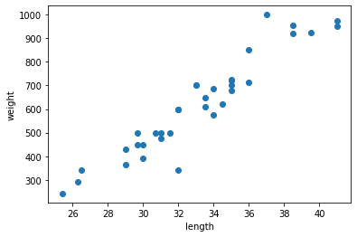
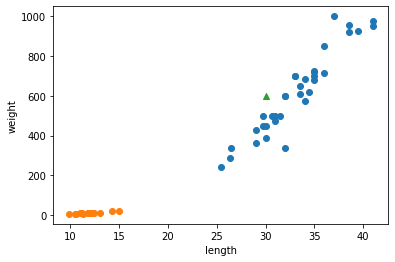

# 01-3 마켓과 머신러닝

## 생선 분류 문제

### 데이터의 유형
* 여러 데이터를 다룰 때 데이터의 분류 방법에 대한 정리
#### 1. 데이터 속성에 따른 분류
> * 양적 데이터(정량적): 수학 연산(덧셈, 뺄셈 등)이 가능한 데이터
>   * 연속형: 연속적인 값을 가지는 데이터(ex 키, 몸무게 등)
>   * 이산형: counting 가능한 데이터(ex 사람, 물건 수 등)
> * 질적 데이터(정성적): 범주형 데이터, 수학 연산이 불가능한 데이터
>   * 순서형: 순서가 정해져 있는 데이터(ex 대학 성적 - A+, A0, B+, ... 등 데이터 간 사칙연산이 불가하며 무의미한 데이터)
>   * 명목형: 순위가 따로 없는 데이터(ex 성별 - 남/여)

<br/>

#### 2. 측정의 수준에 따른 분류
> * 명목 척도: 관찰 대상의 속성 분류를 위하여 이름을 대신하는 숫자다 기호를 부여(ex 성별, 직업 등)
> * 비율 척도: 측정하고자 하는 속성의 실제 양을 수치로 나타낸 것, 절대 0점이 기준(ex 키, 몸무게 등)
> * 등간 척도: 일정한 간격이 있는 척도 상에 대상이 가지고 있는 정도만을 나타낸 것, 절대 0점이 아닌 임의의 0점(ex 온도 등)
> * 순서 척도: 단지 관찰대상의 순위만을 나타내는 수치를 부여(ex 등수 등)

<br/>

## 첫 번째 머신러닝 프로그램

## 도미와 빙어 분류

## Assignment #1

Neighbors의 수를 임의로 조정할 수 있는 K-Means Algorithms은 주관성이 개입될 우려가 있을 것으로 보인다.
이에 Neighbors의 수가 기본값 5로 지정된 K-Means Algorithms에 대해서 만약 Neighbors 데이터의 갯수가 Default Value보다 작다면 어떻게 될 것인가?
이를 코드로 구현해 보이시오.

### 김종훈
``` python
bream_length = [25.4, 26.3, 26.5, 29.0, 29.0, 29.7, 29.7, 30.0, 30.0, 30.7, 31.0, 31.0, 
                31.5, 32.0, 32.0, 32.0, 33.0, 33.0, 33.5, 33.5, 34.0, 34.0, 34.5, 35.0, 
                35.0, 35.0, 35.0, 36.0, 36.0, 37.0, 38.5, 38.5, 39.5, 41.0, 41.0]
bream_weight = [242.0, 290.0, 340.0, 363.0, 430.0, 450.0, 500.0, 390.0, 450.0, 500.0, 475.0, 500.0, 
                500.0, 340.0, 600.0, 600.0, 700.0, 700.0, 610.0, 650.0, 575.0, 685.0, 620.0, 680.0, 
                700.0, 725.0, 720.0, 714.0, 850.0, 1000.0, 920.0, 955.0, 925.0, 975.0, 950.0]
smelt_length = [9.8, 10.5, 10.6, 11.0, 11.2, 11.3, 11.8, 11.8, 12.0, 12.2, 12.4, 13.0, 14.3, 15.0]
smelt_weight = [6.7, 7.5, 7.0, 9.7, 9.8, 8.7, 10.0, 9.9, 9.8, 12.2, 13.4, 12.2, 19.7, 19.9]

import matplotlib.pyplot as plt
from sklearn.neighbors import KNeighborsClassifier

plt.scatter(bream_length ,bream_weight)
plt.scatter(smelt_length , smelt_weight)
plt.xlabel('length')
plt.ylabel('weight')
plt.show()

length = bream_length + smelt_length
weight = bream_weight + smelt_weight

fish_data = [[l,w] for l, w in zip(length, weight)]

#print(fish_data)

fish_target = [1] * 35 + [0] * 14
#print(fish_target)

kn = KNeighborsClassifier()

#kn.fit(fish_data, fish_target)

#kn.score(fish_data, fish_target)

#kn.predict([[30, 600]])

kn49 = KNeighborsClassifier(n_neighbors=49)

kn49.fit(fish_data, fish_target)
print(kn49.score(fish_data, fish_target))

print('Assignment#1') # Assignment#1 codes

kn4 = KNeighborsClassifier(n_neighbors=4)
kn3 = KNeighborsClassifier(n_neighbors=3)
kn2 = KNeighborsClassifier(n_neighbors=2)
kn1 = KNeighborsClassifier(n_neighbors=1)

kn4.fit(fish_data, fish_target)
print(kn4.score(fish_data, fish_target))

kn3.fit(fish_data, fish_target)
print(kn3.score(fish_data, fish_target))

kn2.fit(fish_data, fish_target)
print(kn2.score(fish_data, fish_target))

kn1.fit(fish_data, fish_target)
print(kn1.score(fish_data, fish_target))
```

### 김종혁

#### 마켓과 머신러닝

##### 생선 분류 문제

###### 도미 데이터 준비하기


```python
bream_length = [25.4, 26.3, 26.5, 29.0, 29.0, 29.7, 29.7, 30.0, 30.0, 30.7, 31.0, 31.0, 31.5, 32.0, 32.0, 32.0, 33.0, 33.0, 33.5, 33.5, 34.0, 34.0, 34.5, 35.0, 35.0, 35.0, 35.0, 36.0, 36.0, 37.0, 38.5, 38.5, 39.5, 41.0, 41.0]
bream_weight = [242.0, 290.0, 340.0, 363.0, 430.0, 450.0, 500.0, 390.0, 450.0, 500.0, 475.0, 500.0, 500.0, 340.0, 600.0, 600.0, 700.0, 700.0, 610.0, 650.0, 575.0, 685.0, 620.0, 680.0, 700.0, 725.0, 720.0, 714.0, 850.0, 1000.0, 920.0, 955.0, 925.0, 975.0, 950.0]
```


```python
import matplotlib.pyplot as plt

plt.scatter(bream_length, bream_weight)
plt.xlabel('length')
plt.ylabel('weight')
plt.show()
```


    

    


###### 빙어 데이터 준비하기


```python
smelt_length = [9.8, 10.5, 10.6, 11.0, 11.2, 11.3, 11.8, 11.8, 12.0, 12.2, 12.4, 13.0, 14.3, 15.0]
smelt_weight = [6.7, 7.5, 7.0, 9.7, 9.8, 8.7, 10.0, 9.9, 9.8, 12.2, 13.4, 12.2, 19.7, 19.9]
```


```python
plt.scatter(bream_length, bream_weight)
plt.scatter(smelt_length, smelt_weight)
plt.xlabel('length')
plt.ylabel('weight')
plt.show()
```


    

    


##### 첫 번째 머신러닝 프로그램


```python
length = bream_length+smelt_length
weight = bream_weight+smelt_weight
```


```python
fish_data = [[l, w] for l, w in zip(length, weight)]

print(fish_data)
```

    [[25.4, 242.0], [26.3, 290.0], [26.5, 340.0], [29.0, 363.0], [29.0, 430.0], [29.7, 450.0], [29.7, 500.0], [30.0, 390.0], [30.0, 450.0], [30.7, 500.0], [31.0, 475.0], [31.0, 500.0], [31.5, 500.0], [32.0, 340.0], [32.0, 600.0], [32.0, 600.0], [33.0, 700.0], [33.0, 700.0], [33.5, 610.0], [33.5, 650.0], [34.0, 575.0], [34.0, 685.0], [34.5, 620.0], [35.0, 680.0], [35.0, 700.0], [35.0, 725.0], [35.0, 720.0], [36.0, 714.0], [36.0, 850.0], [37.0, 1000.0], [38.5, 920.0], [38.5, 955.0], [39.5, 925.0], [41.0, 975.0], [41.0, 950.0], [9.8, 6.7], [10.5, 7.5], [10.6, 7.0], [11.0, 9.7], [11.2, 9.8], [11.3, 8.7], [11.8, 10.0], [11.8, 9.9], [12.0, 9.8], [12.2, 12.2], [12.4, 13.4], [13.0, 12.2], [14.3, 19.7], [15.0, 19.9]]


```python
fish_target = [1]*35 + [0]*14
print(fish_target)
```

    [1, 1, 1, 1, 1, 1, 1, 1, 1, 1, 1, 1, 1, 1, 1, 1, 1, 1, 1, 1, 1, 1, 1, 1, 1, 1, 1, 1, 1, 1, 1, 1, 1, 1, 1, 0, 0, 0, 0, 0, 0, 0, 0, 0, 0, 0, 0, 0, 0]


```python
!pip3 install sklearn
```

    DEPRECATION: Configuring installation scheme with distutils config files is deprecated and will no longer work in the near future. If you are using a Homebrew or Linuxbrew Python, please see discussion at https://github.com/Homebrew/homebrew-core/issues/76621
    Requirement already satisfied: sklearn in /usr/local/lib/python3.9/site-packages (0.0)
    Requirement already satisfied: scikit-learn in /usr/local/lib/python3.9/site-packages (from sklearn) (1.1.1)
    Requirement already satisfied: numpy>=1.17.3 in /Users/kimjonghyeok/Library/Python/3.9/lib/python/site-packages (from scikit-learn->sklearn) (1.22.4)
    Requirement already satisfied: scipy>=1.3.2 in /usr/local/lib/python3.9/site-packages (from scikit-learn->sklearn) (1.8.1)
    Requirement already satisfied: joblib>=1.0.0 in /usr/local/lib/python3.9/site-packages (from scikit-learn->sklearn) (1.1.0)
    Requirement already satisfied: threadpoolctl>=2.0.0 in /usr/local/lib/python3.9/site-packages (from scikit-learn->sklearn) (3.1.0)
    DEPRECATION: Configuring installation scheme with distutils config files is deprecated and will no longer work in the near future. If you are using a Homebrew or Linuxbrew Python, please see discussion at https://github.com/Homebrew/homebrew-core/issues/76621
    WARNING: There was an error checking the latest version of pip.
    


```python
from sklearn.neighbors import KNeighborsClassifier
```


```python
kn = KNeighborsClassifier()
```


```python
kn.fit(fish_data, fish_target)
```


```python
kn.score(fish_data, fish_target)
```


    1.0


##### k-최근접 이웃 알고리즘


```python
plt.scatter(bream_length, bream_weight)
plt.scatter(smelt_length, smelt_weight)
plt.scatter(30, 600, marker='^')
plt.xlabel('length')
plt.ylabel('weight')
plt.show()
```


    

    


```python
kn.predict([[30, 600]])
```


    array([1])


```python
print(kn._fit_X)
```

    [[  25.4  242. ]
     [  26.3  290. ]
     [  26.5  340. ]
     [  29.   363. ]
     [  29.   430. ]
     [  29.7  450. ]
     [  29.7  500. ]
     [  30.   390. ]
     [  30.   450. ]
     [  30.7  500. ]
     [  31.   475. ]
     [  31.   500. ]
     [  31.5  500. ]
     [  32.   340. ]
     [  32.   600. ]
     [  32.   600. ]
     [  33.   700. ]
     [  33.   700. ]
     [  33.5  610. ]
     [  33.5  650. ]
     [  34.   575. ]
     [  34.   685. ]
     [  34.5  620. ]
     [  35.   680. ]
     [  35.   700. ]
     [  35.   725. ]
     [  35.   720. ]
     [  36.   714. ]
     [  36.   850. ]
     [  37.  1000. ]
     [  38.5  920. ]
     [  38.5  955. ]
     [  39.5  925. ]
     [  41.   975. ]
     [  41.   950. ]
     [   9.8    6.7]
     [  10.5    7.5]
     [  10.6    7. ]
     [  11.     9.7]
     [  11.2    9.8]
     [  11.3    8.7]
     [  11.8   10. ]
     [  11.8    9.9]
     [  12.     9.8]
     [  12.2   12.2]
     [  12.4   13.4]
     [  13.    12.2]
     [  14.3   19.7]
     [  15.    19.9]]


```python
print(kn._y)
```

    [1 1 1 1 1 1 1 1 1 1 1 1 1 1 1 1 1 1 1 1 1 1 1 1 1 1 1 1 1 1 1 1 1 1 1 0 0
     0 0 0 0 0 0 0 0 0 0 0 0]


```python
kn49 = KNeighborsClassifier(n_neighbors=49)
```


```python
kn49.fit(fish_data, fish_target)
kn49.score(fish_data, fish_target)
```


    0.7142857142857143


```python
print(35/49)
```

    0.7142857142857143


##### Assignment #1


```python
kn = KNeighborsClassifier()
kn.fit(fish_data, fish_target)

for n in range(1, 50):
    
    # 최근접 이웃 개수 설정
    kn.n_neighbors = n

    # 점수 계산
    score = kn.score(fish_data, fish_target)

    if score < 1:
        print(n, score)
    else:
        print(n, score)
```

    1 1.0
    2 1.0
    3 1.0
    4 1.0
    5 1.0
    6 1.0
    7 1.0
    8 1.0
    9 1.0
    10 1.0
    11 1.0
    12 1.0
    13 1.0
    14 1.0
    15 1.0
    16 1.0
    17 1.0
    18 0.9795918367346939
    19 0.9795918367346939
    20 0.9795918367346939
    21 0.9795918367346939
    22 0.9795918367346939
    23 0.9795918367346939
    24 0.9795918367346939
    25 0.9795918367346939
    26 0.9795918367346939
    27 0.9795918367346939
    28 0.9591836734693877
    29 0.7142857142857143
    30 0.7142857142857143
    31 0.7142857142857143
    32 0.7142857142857143
    33 0.7142857142857143
    34 0.7142857142857143
    35 0.7142857142857143
    36 0.7142857142857143
    37 0.7142857142857143
    38 0.7142857142857143
    39 0.7142857142857143
    40 0.7142857142857143
    41 0.7142857142857143
    42 0.7142857142857143
    43 0.7142857142857143
    44 0.7142857142857143
    45 0.7142857142857143
    46 0.7142857142857143
    47 0.7142857142857143
    48 0.7142857142857143
    49 0.7142857142857143