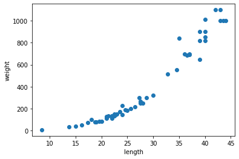

# 03-1 k-최근접 이웃 회귀

:::success 학습 목표
지도 학습의 한 종류인 회귀 문제를 이해하고 k-최근접 이웃 알고리즘을 사용해 농어의 무게를 예측하는 회귀 문제를 풀어 봅니다.
:::

## k-최근접 이웃 회귀

지도 학습 알고리즘은 크게 분류와 **회귀(regression)**으로 나뉩니다.

분류는 샘플을 몇 개의 클래스 중 하나로 분류하는 문제입니다.

반면, 회귀는 클래스 중 하나로 분류하는 것이 아니라 임의의 어떤 숫자를 예측하는 문제입니다.

:::info 정보
19세기 통계학자이자 사회학자인 프랜시스 골턴(Francis Galton)이 회귀라는 용어를 처음 사용했습니다. 그는 키가 큰 사람의 아이가 부모보다 더 크지 않다는 사실을 관찰하고 이에 대해 **"평균으로 회귀한다."**라고 표현했습니다. 그 후 두 변수 사이의 상관관계를 분석하는 방법을 회귀라 불렀습니다.
:::

## 데이터 준비

### numpy를 이용한 데이터 준비하기 - 브로드캐스팅

* 사전적 정의: 브로드캐스팅(broadcasting)은 송신 호스트가 전송한 데이터가 네트워크에 연결된 모든 호스트에 전송되는 방식을 의미한다.

* numpy에서의 브로드캐스팅: 형태가 다른 배열끼리의 연산을 수행하게 해주는 기능

### 브로드캐스팅의 조건

1. 빈 배열을 제외한 멤버가 하나인 배열은 어떠한 형태의 배열과도 브로드캐스팅 가능

    -> 각 요소마다 더해짐
    * array[3][4] + array[1]

    ```python
    array1=np.array([[1, 2, 3, 4], [5, 6, 7, 8], [9, 10, 11, 12]])
    array2=np.array([1])

    array1+array2
    ```
    > [[ 2  3  4  5]
    >
    > [ 6  7  8  9]
    >
    > [10 11 12 13]]

2. 2차원 배열의 각 요소 배열의 길이와 같은 길이의 1차원 배열과 브로드캐스팅 가능

    ->각 요소 배열과 더해짐
    * array[3][4] + array[4]

    ```python
    array1=np.array([[1, 2, 3, 4], [5, 6, 7, 8], [9, 10, 11, 12]])
    array2=np.array([3, 3, 3, 3])

    array1+array2
    ```
    result
    >[[ 4  5  6  7]
    >
    > [ 8  9 10 11]
    >
    > [12 13 14 15]]

3. 두 배열의 차원의 짝이 맞는 경우 브로드캐스팅 가능
    * array[3][4] + array[3][4]

    ```python
    array1=np.array([[1, 2, 3, 4], [5, 6, 7, 8], [9, 10, 11, 12]])
    array2=np.array([[1, 2, 3, 4], [5, 6, 7, 8], [9, 10, 11, 12]])
    ```
    result
    > [[ 2  4  6  8]
    >
    > [10 12 14 16]
    >
    > [18 20 22 24]]

    * array[4][1] + array[1][4]
    ```python
    array1=np.array([1, 1, 1, 1])
    array2=np.array([[1], [2], [3], [4]])
    ```
    result
    > [[2 2 2 2]
    >
    > [3 3 3 3]
    >
    > [4 4 4 4]
    >
    > [5 5 5 5]]


## 결정계수($R^{2}$)

### 평가

분류의 경우에는 테스트 세트에 있는 샘플을 정확하게 분류한 개수의 비율 즉, 정확도(간단히 말해 정답을 맞힌 개수의 비율)로서 모델을 평가하였지만, 회귀에서는 정확한 숫자를 맞힌다는 것은 거의 불가능에 가까우므로(예측하는 값이나 타깃 모두 임의의 수치이기 때문이다.) 결정계수(coefficient of determination), $R^{2}$를 이용해 이를 평가한다.

이는 다음과 같이 계산되어진다.

$R^{2} = 1 - \frac{(\text{타깃 - 예측})^{2}\text{의 합}}{(\text{타깃 - 평균}^{2})\text{의 합}}$

여기서 예측이 타깃의 평균 정도를 예측하는 수준인 경우에는 $R^{2}$는 0에 가까워지고, 예측이 타깃에 아주 가까워지면 1에 가까운 값이 된다.

:::caution 정보

사이킷런은 `sklearn.metrics` 패키지 아래 여러 가지 측정 도구를 제공합니다.

:::

## 과대적합 vs 과소적합

모델을 훈련 세트에 훈련하면 훈련 세트에 잘 맞는 모델이 만들어집니다.

보통 훈련 세트의 점수가 테스트 세트의 점수보다 조금 더 높게 나오는데, 그 이유는 훈련 세트에서 모델이 훈련되어졌기 때문입니다.

:::success 정보

만약 훈련 세트에서 점수가 굉장히 좋았는데 테스트 세트에서는 점수가 굉장히 나쁘다면 모델이 훈련 세트에 과대적합(overfitting)되었다고 말합니다. 즉, 훈련 세트에만 잘 맞는 모델이므로 테스트 세트와 새로운 샘플에 대한 예측을 만들 때 제대로 동작하지 않을 것입니다.

반대로 훈련 세트보다 테스트 세트의 점수가 높거나 두 점수가 모두 너무 낮은 경우를 모델이 훈련 세트에 과소적합(underfitting)되었다고 말합니다. 즉, 모델이 너무 단순하여 훈련 세트에 적절히 훈련되지 않은 경우입니다.

:::

:::info 정보

훈련 세트와 테스트 세트의 점수를 비교했을 때 훈련 세트가 너무 높으면 과대적합, 그 반대이거나 두 점수가 모두 낮으면 과소적합입니다.

:::

## 회귀 문제 다루기

# Assignment #1

 본 챕터에 존재하는 예제 소스를 작성하시오. (또한, 별도로 과제 부여받으신 분들께서도 적절한 Chapter의 본 Assignment Section 이하에 해당 내용을 기재해주세요.)

## 종혁

```python
import numpy as np
```


```python
perch_length = np.array([8.4, 13.7, 15.0, 16.2, 17.4, 18.0, 18.7, 19.0, 19.6, 20.0, 21.0,
       21.0, 21.0, 21.3, 22.0, 22.0, 22.0, 22.0, 22.0, 22.5, 22.5, 22.7,
       23.0, 23.5, 24.0, 24.0, 24.6, 25.0, 25.6, 26.5, 27.3, 27.5, 27.5,
       27.5, 28.0, 28.7, 30.0, 32.8, 34.5, 35.0, 36.5, 36.0, 37.0, 37.0,
       39.0, 39.0, 39.0, 40.0, 40.0, 40.0, 40.0, 42.0, 43.0, 43.0, 43.5,
       44.0])
perch_weight = np.array([5.9, 32.0, 40.0, 51.5, 70.0, 100.0, 78.0, 80.0, 85.0, 85.0, 110.0,
       115.0, 125.0, 130.0, 120.0, 120.0, 130.0, 135.0, 110.0, 130.0,
       150.0, 145.0, 150.0, 170.0, 225.0, 145.0, 188.0, 180.0, 197.0,
       218.0, 300.0, 260.0, 265.0, 250.0, 250.0, 300.0, 320.0, 514.0,
       556.0, 840.0, 685.0, 700.0, 700.0, 690.0, 900.0, 650.0, 820.0,
       850.0, 900.0, 1015.0, 820.0, 1100.0, 1000.0, 1100.0, 1000.0,
       1000.0])
```


```python
!pip3 install Pillow
```

    /usr/lib/python3/dist-packages/secretstorage/dhcrypto.py:15: CryptographyDeprecationWarning: int_from_bytes is deprecated, use int.from_bytes instead
      from cryptography.utils import int_from_bytes
    /usr/lib/python3/dist-packages/secretstorage/util.py:19: CryptographyDeprecationWarning: int_from_bytes is deprecated, use int.from_bytes instead
      from cryptography.utils import int_from_bytes
    Requirement already satisfied: Pillow in /usr/local/lib/python3.6/dist-packages (8.4.0)
    WARNING: You are using pip version 19.3.1; however, version 21.3.1 is available.
    You should consider upgrading via the 'pip install --upgrade pip' command.


```python
!pip3 install matplotlib
```

    /usr/lib/python3/dist-packages/secretstorage/dhcrypto.py:15: CryptographyDeprecationWarning: int_from_bytes is deprecated, use int.from_bytes instead
      from cryptography.utils import int_from_bytes
    /usr/lib/python3/dist-packages/secretstorage/util.py:19: CryptographyDeprecationWarning: int_from_bytes is deprecated, use int.from_bytes instead
      from cryptography.utils import int_from_bytes
    Requirement already satisfied: matplotlib in /usr/local/lib/python3.6/dist-packages (3.1.2)
    Requirement already satisfied: numpy>=1.11 in /usr/local/lib/python3.6/dist-packages (from matplotlib) (1.19.5)
    Requirement already satisfied: pyparsing!=2.0.4,!=2.1.2,!=2.1.6,>=2.0.1 in /usr/local/lib/python3.6/dist-packages (from matplotlib) (2.4.6)
    Requirement already satisfied: cycler>=0.10 in /usr/local/lib/python3.6/dist-packages (from matplotlib) (0.10.0)
    Requirement already satisfied: kiwisolver>=1.0.1 in /usr/local/lib/python3.6/dist-packages (from matplotlib) (1.1.0)
    Requirement already satisfied: python-dateutil>=2.1 in /usr/local/lib/python3.6/dist-packages (from matplotlib) (2.8.1)
    Requirement already satisfied: six in /usr/local/lib/python3.6/dist-packages (from cycler>=0.10->matplotlib) (1.15.0)
    Requirement already satisfied: setuptools in /usr/local/lib/python3.6/dist-packages (from kiwisolver>=1.0.1->matplotlib) (44.0.0)
    WARNING: You are using pip version 19.3.1; however, version 21.3.1 is available.
    You should consider upgrading via the 'pip install --upgrade pip' command.


```python
import matplotlib.pyplot as plt
```


```python
plt.scatter(perch_length, perch_weight)
plt.xlabel('length')
plt.ylabel('weight')
plt.show()
```


    

    


```python
!pip3 install sklearn
```

    /usr/lib/python3/dist-packages/secretstorage/dhcrypto.py:15: CryptographyDeprecationWarning: int_from_bytes is deprecated, use int.from_bytes instead
      from cryptography.utils import int_from_bytes
    /usr/lib/python3/dist-packages/secretstorage/util.py:19: CryptographyDeprecationWarning: int_from_bytes is deprecated, use int.from_bytes instead
      from cryptography.utils import int_from_bytes
    Requirement already satisfied: sklearn in /usr/local/lib/python3.6/dist-packages (0.0)
    Requirement already satisfied: scikit-learn in /usr/local/lib/python3.6/dist-packages (from sklearn) (0.24.2)
    Requirement already satisfied: scipy>=0.19.1 in /usr/local/lib/python3.6/dist-packages (from scikit-learn->sklearn) (1.4.1)
    Requirement already satisfied: threadpoolctl>=2.0.0 in /usr/local/lib/python3.6/dist-packages (from scikit-learn->sklearn) (3.1.0)
    Requirement already satisfied: numpy>=1.13.3 in /usr/local/lib/python3.6/dist-packages (from scikit-learn->sklearn) (1.19.5)
    Requirement already satisfied: joblib>=0.11 in /usr/local/lib/python3.6/dist-packages (from scikit-learn->sklearn) (1.1.0)
    WARNING: You are using pip version 19.3.1; however, version 21.3.1 is available.
    You should consider upgrading via the 'pip install --upgrade pip' command.


```python
from sklearn.model_selection import train_test_split

train_input, test_input, train_target, test_target = train_test_split(perch_length, perch_weight, random_state=42)
```


```python
test_array = np.array([1, 2, 3, 4])
```


```python
print(test_array.shape)
```

    (4,)


```python
test_array = test_array.reshape(2, 2)
```


```python
print(test_array.shape)
```

    (2, 2)


```python
train_input = train_input.reshape(-1, 1)
test_input = test_input.reshape(-1, 1)
```


```python
print(train_input.shape, test_input.shape)
```

    (42, 1) (14, 1)


```python
from sklearn.neighbors import KNeighborsRegressor
```


```python
knr = KNeighborsRegressor()
```


```python
# k-최근접 이웃 회귀 모델을 훈련합니다.
knr.fit(train_input, train_target)
```


    KNeighborsRegressor()


```python
print(knr.score(test_input, test_target))
```

    0.992809406101064


```python
from sklearn.metrics import mean_absolute_error
```


```python
# 테스트 세트에 대한 예측을 만듭니다.
test_prediction = knr.predict(test_input)

# 테스트 세트에 대한 평균 절댓값 오차를 계산합니다.
mae = mean_absolute_error(test_target, test_prediction)
```


```python
print(mae)
```

    19.157142857142862


### 과대적합 vs 과소적합


```python
print(knr.score(train_input, train_target))
```

    0.9698823289099254


```python
# 이웃의 개수를 3으로 설정합니다.
knr.n_neighbors = 3

# 모델을 다시 훈련합니다.
knr.fit(train_input, train_target)
```


    KNeighborsRegressor(n_neighbors=3)


```python
print(knr.score(train_input, train_target))
```

    0.9804899950518966


## 우진

3-1 k-최근접 이웃 회귀

--- 

지도 학습 알고리즘은 크게 분류와 회귀로 나뉜다. 앞서 학습한 2장은 분류를 학습한 것이다.
회귀는 클래스 중 하나로 분류하는 것이 아니라 임의의 어떤 숫자를 예측하는 문제이다. (= 두 변수 사이의 상관관계를 분석하는 방법)

k-최근접 이웃 분류 알고리즘이란?
 - 예측하려는 샘플에 가장 가까운 샘플 k개를 선택한다.
 - 선택된 샘플들의 클래스를 확인하여 다수 클래스를 새로운 샘플의 클래스로 예측한다.

k-최근접 이웃 회귀 알고리즘이란?
 - 예측하려는 샘플에 가장 가까운 샘플 k개를 선택한다.
 - 그러나 회귀는 이웃한 샘플의 타깃이 어떤 클래스가 아니라 임의의 수치이다.
 - 따라서 수치들의 평균을 구하면 된다.


```python
import matplotlib.pyplot as plt
import numpy as np
from sklearn.model_selection import train_test_split
from sklearn.neighbors import KNeighborsRegressor
from sklearn.metrics import mean_absolute_error

# 데이터 입력
perch_length = np.array(
    [8.4, 13.7, 15.0, 16.2, 17.4, 18.0, 18.7, 19.0, 19.6, 20.0, 
     21.0, 21.0, 21.0, 21.3, 22.0, 22.0, 22.0, 22.0, 22.0, 22.5, 
     22.5, 22.7, 23.0, 23.5, 24.0, 24.0, 24.6, 25.0, 25.6, 26.5, 
     27.3, 27.5, 27.5, 27.5, 28.0, 28.7, 30.0, 32.8, 34.5, 35.0, 
     36.5, 36.0, 37.0, 37.0, 39.0, 39.0, 39.0, 40.0, 40.0, 40.0, 
     40.0, 42.0, 43.0, 43.0, 43.5, 44.0]
     )
perch_weight = np.array(
    [5.9, 32.0, 40.0, 51.5, 70.0, 100.0, 78.0, 80.0, 85.0, 85.0, 
     110.0, 115.0, 125.0, 130.0, 120.0, 120.0, 130.0, 135.0, 110.0, 
     130.0, 150.0, 145.0, 150.0, 170.0, 225.0, 145.0, 188.0, 180.0, 
     197.0, 218.0, 300.0, 260.0, 265.0, 250.0, 250.0, 300.0, 320.0, 
     514.0, 556.0, 840.0, 685.0, 700.0, 700.0, 690.0, 900.0, 650.0, 
     820.0, 850.0, 900.0, 1015.0, 820.0, 1100.0, 1000.0, 1100.0, 
     1000.0, 1000.0]
     )

plt.scatter(perch_length, perch_weight)
plt.xlabel('length')
plt.ylabel('weight')
plt.show()
```


    

    


```python
# 농어 데이터를 훈련 세트와 테스트 세트로 나누는 과정

train_input, test_input, train_target, test_target = train_test_split(perch_length, perch_weight, random_state=42)
```


```python
# 사이킷런에 사용될 훈련 세트는 2차원 배열이어야 함.
# 따라서 아래에서는 1차원 배열을 2차원 배열로 바꾸는 작업.

test_array = np.array([1,2,3,4])
print(test_array.shape)
```

    (4,)
    


```python
test_array = test_array.reshape(2, 2)
print(test_array.shape)
```

    (2, 2)
    


```python
# reshape() 메서드는 크기가 바뀐 새로운 배열을 반환할 때 지정한 크기가 원본 배열에 있는 원소의 개수와 다르면 에러가 발생함.
# 예를 들어 아래와 같이 (4, ) 크기의 배열을 (2, 3)으로 바꾸려고 하면 에러가 발생함.
# 원본 배열의 원소는 4개인데 2 * 3 = 6개로 바꾸려고 하기 때문.

# test_array = test_array.reshape(2, 3)
```


```python
# 넘파이의 배열 크기를 자동으로 지정하는 기능
# 크기에 -1 지정 시 나머지 원소 개수로 모두 채우라는 의미
# ex) 첫 번째 크기를 나머지 원소 개수로 채우고, 두 번째 크기를 1로 하려면 (train_input.reshape(-1, 1)처럼 사용.

train_input = train_input.reshape(-1, 1)
test_input = test_input.reshape(-1, 1)
print(train_input.shape, test_input.shape)
```

    (42, 1) (14, 1)
    


```python
# 결정계수(R^2)
knr = KNeighborsRegressor()

# k-최근접 이웃 회귀 모델을 훈련합니다
knr.fit(train_input, train_target)
knr.score(test_input, test_target)
```


    0.992809406101064


```python
# 테스트 세트에 대한 예측을 만듭니다
test_prediction = knr.predict(test_input)

# 테스트 세트에 대한 평균 절댓값 오차를 계산합니다
mae = mean_absolute_error(test_target, test_prediction)
print(mae)
```

    19.157142857142862
    


```python
# 과대적합 vs 과소적합
print(knr.score(train_input, train_target))
```

    0.9698823289099254
    


```python
# 이웃의 갯수를 3으로 설정합니다
knr.n_neighbors = 3
# 모델을 다시 훈련합니다
knr.fit(train_input, train_target)
print(knr.score(train_input, train_target))
```

    0.9804899950518966
    


```python
print(knr.score(test_input, test_target))
```

    0.9746459963987609
    
---

정리

1. k-최근접 이웃 회귀 모델은 분류와 동일하게 가장 먼저 가까운 k개의 이웃을 찾고 이웃 샘플의 타깃값으로 평균값을 내어 이 샘플의 예측값으로 사용합니다.
2. 사이킷런은 회귀 모델의 점수로 R^2, 즉 결정계수 값을 반환합니다. 이 값은 1에 가까울수록 좋습니다.
   - 이에 정량적인 평가를 원한다면 사이킷런에서 제공하는 다른 평가 도구를 사용할 수 있는데, 대표적으로 절댓값 오차가 있습니다.
3. 모델을 훈련시키고 나서 훈련 세트와 테스트 세트에 대해 모두 평가 점수를 구할 수 있는데 두 평가 점수 사이의 차이가 크면 좋지 않습니다.
   - 일반적으로 훈련 세트의 점수가 테스트 세트의 점수보다 약간 더 높습니다.
   - 만약 테스트 세트의 점수가 너무 낮다면 모델이 훈련 세트에 과도하게 맞춰진 것입니다. (= 과대적합)
   - 만약 테스트 세트의 점수가 너무 높거나 두 점수 모두 낮다면 과소적합이라고 합니다.
4. 과대적합일 경우 모델의 복잡도를 낮춰야합니다.
   - k-최근접 이웃의 경우 k값을 늘립니다.
5. 과소적합일 경우 모델의 복잡도를 높혀야합니다.
   - k-최근접 이웃의 경우 k값을 줄입니다.


## 정훈
3-1 k-최근접 이웃 회귀 알고리즘

---

농어 데이터 세팅


```python
import numpy as np
#features of perch
perch_length = np.array([8.4, 13.7, 15.0, 16.2, 17.4, 18.0, 18.7, 19.0, 19.6, 20.0, 21.0,
       21.0, 21.0, 21.3, 22.0, 22.0, 22.0, 22.0, 22.0, 22.5, 22.5, 22.7,
       23.0, 23.5, 24.0, 24.0, 24.6, 25.0, 25.6, 26.5, 27.3, 27.5, 27.5,
       27.5, 28.0, 28.7, 30.0, 32.8, 34.5, 35.0, 36.5, 36.0, 37.0, 37.0,
       39.0, 39.0, 39.0, 40.0, 40.0, 40.0, 40.0, 42.0, 43.0, 43.0, 43.5,
       44.0])

perch_weight = np.array([5.9, 32.0, 40.0, 51.5, 70.0, 100.0, 78.0, 80.0, 85.0, 85.0, 110.0,
       115.0, 125.0, 130.0, 120.0, 120.0, 130.0, 135.0, 110.0, 130.0,
       150.0, 145.0, 150.0, 170.0, 225.0, 145.0, 188.0, 180.0, 197.0,
       218.0, 300.0, 260.0, 265.0, 250.0, 250.0, 300.0, 320.0, 514.0,
       556.0, 840.0, 685.0, 700.0, 700.0, 690.0, 900.0, 650.0, 820.0,
       850.0, 900.0, 1015.0, 820.0, 1100.0, 1000.0, 1100.0, 1000.0,
       1000.0])
```
데이터의 산점도 그래프 출력

```python
import matplotlib.pyplot as plt

plt.scatter(perch_length, perch_weight)
plt.xlabel("length")
plt.ylabel("weight")
plt.show()
```


train_test_split을 이용한 데이터 셋 준비

```python
from sklearn.model_selection import train_test_split

#훈련 세트, 테스트 세트 생성(data: length, target: weight)
train_input, test_input, train_target, test_target=train_test_split(perch_length, perch_weight, random_state=42)
print(train_input.shape, test_input.shape)

#각 원소를 길이가 1인 배열을 가지는 2차원 배열 생성
#-> reshape(배열의 원소 개수, 원소 배열 당 원소 개수)

#=reshape(42, 1)
train_input=train_input.reshape(-1, 1)
#=reshape(14, 1)
test_input=test_input.reshape(-1, 1)
print(train_input.shape, test_input.shape)
```
> (42,) (14,)
> (42, 1) (14, 1)

최근접 이웃 회귀 알고리즘 훈련과 모델 평가(결정계수)

```python
#K-최근접 이웃 회귀 알고리즘 구현 클래스
from sklearn.neighbors import KNeighborsRegressor

knr=KNeighborsRegressor()
knr.fit(train_input, train_target)
#모델 평가 - 결정계수
#1-(타깃-예측)^2의 합 / (타깃-평균)^2의 합
#-> 예측이 타깃과 가까울수록 분자가 0과 가까워져 결정계수가 1에 가까워짐
#-> 예측이 평균 정도에 그치면 분수가 1에 가까워져 결정계수가 0에 가까워짐
print(knr.score(test_input, test_target))
```
> 0.992809406101064

mean_absolute_error 함수로 평균적인 편차 구하기

```python
#타깃과 예측의 절댓값 오차의 평균을 반환
from sklearn.metrics import mean_absolute_error

#test_input에 대한 예측값
test_prediction=knr.predict(test_input)
#test_target(타깃)과 예측값에 대한 차이의 평균
mae=mean_absolute_error(test_target, test_prediction)

#평균적으로 얼마나 타깃과 멀어진 값을 예측하는가?
print(mae)
```
> 19.157142857142862

약간의 과소적합, 이를 해결하기 위한 n_neighbors의 조정

```python
#과대적합: 훈련세트에만 잘 맞는 모델 - 훈련 세트 점수 >>> 테스트 점수 세트(일반적인 적용 불가능)
#과소적합: 훈련이 덜 된 모델 - 훈련 세트의 점수가 매우 나쁘고 테스트 세트 점수가 높거나, 둘 다 낮은 경우

#과소적합 해결을 위해 neighbors 수 줄이기
#-> 국지적인 패턴에 좀 더 민감해짐
knr.n_neighbors=3
knr.fit(train_input, train_target)
print(knr.score(train_input, train_target))
print(knr.score(test_input, test_target))
```
> 0.9804899950518966
> 0.9746459963987609

reshape함수의 사용(test)

```python
test_array=np.array([1, 2, 3, 4, 5, 6])
print(test_array.shape)
test_array=test_array.reshape(2, 3)
print(test_array)
```
> (6,)
 [[1 2 3]
 [4 5 6]]


