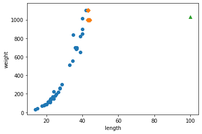
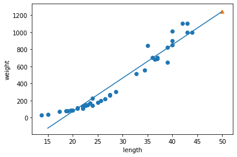
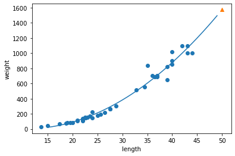
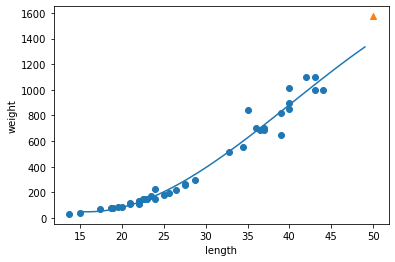
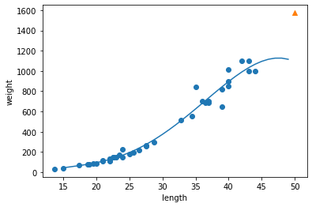
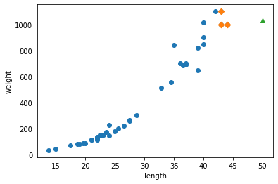
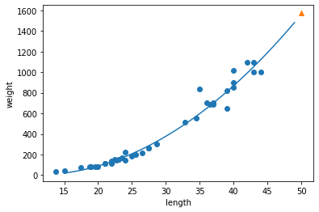
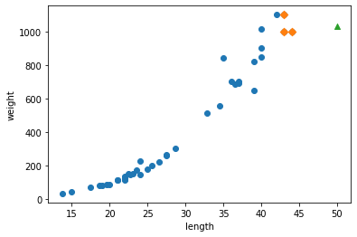

# 03-2 선형 회귀

:::success 학습목표
k-최근접 이웃 회귀와 선형 회귀 알고리즘의 차이를 이해하고 사이킷런을 사용해 여러 가지 선형 회귀 모델을 만들어 봅니다.
:::

## k-최근접 이웃의 한계
* k-최근접 이웃 회귀 알고리즘은 가장 가까운 n_neighbors의 데이터, 즉 거리 기반으로 데이터를 예측하기 때문에 극단적인 데이터를 예측하게 될 경우 제대로 된 예측이 불가능하다.

:::info 해결 방법에 대한 의견
최근접 이웃 알고리즘은 사례 기반 학습(단순한 데이터 저장이 전부)이므로, 극단적인 데이터들을 포함시킨 train 데이터로 다시 훈련을 시키거나, 해당 데이터들의 빈도수 등을 확인하는 등 데이터에 수정을 가하는 방법이 필요할 것
:::

## 선형 회귀
* sklearn의 LinearRegression 클래스를 이용하여 가장 적절한 **모델 파라미터**를 찾는 알고리즘이다. 이러한 최적의 모델 파라미터를 찾는 훈련 과정을 **모델 기반 학습**이라고 한다.

:::info 모델 파라미터, 모델 기반 학습
* 모델 파라미터: n차 방정식에 대하여 n개의 변수에 대한 계수, y절편 등 머신러닝 알고리즘이 찾아내는 값
* 모델 기반 학습: 훈련 데이터를 이용하여 모델 파라미터 중 최적의 값을 찾아내는 것
* 사례 기반 vs 모델 기반: 사례 기반 알고리즘인 k-최근접 이웃 알고리즘은 모델 파라미터를 가지고 있지 않아 데이터를 저장하는 것이 훈련의 전부라는 점에서 차이가 있음
:::

## 다항 회귀

## 선형 회귀로 훈련 세트 범위 밖의 샘플 예측

# Assignment #1

 본 챕터에 존재하는 예제 소스를 작성하시오. (또한, 별도로 과제 부여받으신 분들께서도 적절한 Chapter의 본 Assignment Section 이하에 해당 내용을 기재해주세요.)

 ## 종혁

```python
import numpy as np
```


```python
perch_length = np.array([8.4, 13.7, 15.0, 16.2, 17.4, 18.0, 18.7, 19.0, 19.6, 20.0, 21.0,
       21.0, 21.0, 21.3, 22.0, 22.0, 22.0, 22.0, 22.0, 22.5, 22.5, 22.7,
       23.0, 23.5, 24.0, 24.0, 24.6, 25.0, 25.6, 26.5, 27.3, 27.5, 27.5,
       27.5, 28.0, 28.7, 30.0, 32.8, 34.5, 35.0, 36.5, 36.0, 37.0, 37.0,
       39.0, 39.0, 39.0, 40.0, 40.0, 40.0, 40.0, 42.0, 43.0, 43.0, 43.5,
       44.0])
perch_weight = np.array([5.9, 32.0, 40.0, 51.5, 70.0, 100.0, 78.0, 80.0, 85.0, 85.0, 110.0,
       115.0, 125.0, 130.0, 120.0, 120.0, 130.0, 135.0, 110.0, 130.0,
       150.0, 145.0, 150.0, 170.0, 225.0, 145.0, 188.0, 180.0, 197.0,
       218.0, 300.0, 260.0, 265.0, 250.0, 250.0, 300.0, 320.0, 514.0,
       556.0, 840.0, 685.0, 700.0, 700.0, 690.0, 900.0, 650.0, 820.0,
       850.0, 900.0, 1015.0, 820.0, 1100.0, 1000.0, 1100.0, 1000.0,
       1000.0])
```


```python
from sklearn.model_selection import train_test_split
```


```python
# 훈련 세트와 테스트 세트로 나눕니다.
train_input, test_input, train_target, test_target = train_test_split(perch_length, perch_weight, random_state=42)
```


```python
# 훈련 세트와 테스트 세트를 2차원 배열로 바꿉니다.
train_input = train_input.reshape(-1, 1)
test_input = test_input.reshape(-1, 1)
```


```python
from sklearn.neighbors import KNeighborsRegressor
```


```python
knr = KNeighborsRegressor(n_neighbors=3)
```


```python
# k-최근접 이웃 회귀 모델을 훈련합니다
knr.fit(train_input, train_target)
```


    KNeighborsRegressor(n_neighbors=3)


```python
print(knr.predict([[50]]))
```

    [1033.33333333]


```python
import matplotlib.pyplot as plt
```


```python
# 50cm 농어의 이웃을 구합니다
distances, indexes = knr.kneighbors([[50]])
```


```python
print(distances)
```

    [[6. 7. 7.]]


```python
print(indexes)
```

    [[34  8 14]]


```python
# 훈련 세트의 산점도를 그립니다
plt.scatter(train_input, train_target)

# 훈련 세트 중에서 이웃 샘플만 다시 그립니다
plt.scatter(train_input[[34, 8, 14]], train_target[[34, 8, 14]], marker='D')

# 50cm 농어 데이터 
plt.scatter(50, 1033)
plt.xlabel('length')
plt.ylabel('weight')
plt.show()
```


    

    


> 길이가 커질수록 농어의 무게가 증가하는 경향이 있음.

> 또한, 50cm 농어에서 가장 가까운 것은 45cm 근방이기 때문에 k-최근접 이웃 알고리즘은 이 샘플들의 무게를 평균한다.


```python
print(np.mean(train_target[indexes]))
```

    1033.3333333333333


```python
# 100cm 농어의 이웃을 구합니다.
distances, indexes = knr.kneighbors([[100]])

# 훈련 세트의 산점도를 그립니다.
plt.scatter(train_input, train_target)

# 훈련 세트 중에서 이웃 샘플만 다시 그립니다.
plt.scatter(train_input[indexes], train_target[indexes], marker='D')

# 100cm 농어 데이터
plt.scatter(100, 1033, marker='^')
plt.xlabel('length')
plt.ylabel('weight')
plt.show()
```


    

    


> 머신러닝 모델은 한 번 만들고 끝나는 프로그램이 아니다. 왜냐하면 시간과 환경이 변하면서 데이터도 함께 바뀌기 때문에 주기적으로 새로운 훈련 데이터로 모델을 다시 훈련해야 한다.

# 선형 회귀

> 사이킷런의 모델 클래스들은 훈련, 평가, 예측하는 메서드 이름이 모두 동일하다.

> 즉, LinearRegression 클래스에도 fit(), score(), predict() 메서드가 있다.


```python
from sklearn.linear_model import LinearRegression
```


```python
lr = LinearRegression()
```


```python
# 선형 회귀 모델을 훈련합니다.
lr.fit(train_input, train_target)
```


    LinearRegression()


```python
# 50cm농어에 대해 예측합니다.
print(lr.predict([[50]]))
```

    [1241.83860323]


> 머신러닝에서 기울기를 종종 계수(coefficient) 또는 가중치(weight)라고 부른다.

> coef_와 intercept_를 머신러닝 알고리즘이 찾은 값이라는 의미로 모델 파라미터(model parameter)라고 부른다.

> 머신러닝 알고리즘의 훈련 과정이 최적의 모델 파라미터를 찾는 경우 이를 모델 기반 학습이라고 부른다.

> k-최근접 이웃 모델에는 모델 파라미터가 없고, 훈련 세트를 저장하는 것이 훈련의 전부였으므로, 이러한 경우 사례 기반 학습이라고 한다.


```python
# 훈련 세트의 산점도를 그립니다.
plt.scatter(train_input, train_target)

# 15에서 50까지 1차 방정식 그래프를 그립니다.
plt.plot([15, 50], [15*lr.coef_+lr.intercept_, 50*lr.coef_+lr.intercept_])

# 50cm 농어 데이터
plt.scatter(50, 1241.8, marker='^')
plt.xlabel('length')
plt.ylabel('weight')
plt.show()
```


    

    


```python
print(lr.score(train_input, train_target)) # 훈련 세트
print(lr.score(test_input, test_target)) # 테스트 세트
```

    0.939846333997604
    0.8247503123313558


# 다항 회귀

> numpy broadcasting의 적용으로 train_input에 있는 모든 원소를 제곱함.


```python
## 2차식
train_poly = np.column_stack((train_input ** 2, train_input))
test_poly = np.column_stack((test_input ** 2, test_input))
```


```python
## 2차식
lr = LinearRegression()
lr.fit(train_poly, train_target)

print(lr.predict([[50**2, 50]]))
```

    [1573.98423528]


```python
print(lr.coef_, lr.intercept_)
```

    [  1.01433211 -21.55792498] 116.05021078278276


```python
# 구간별 직선을 그리기 위해 15에서 49까지 정수 배열을 만든다.
point = np.arange(15, 50)

# 훈련 세트의 산점도를 그린다.
plt.scatter(train_input, train_target)

# 15에서 49까지 2차 방정식 그래프를 그린다.
plt.plot(point, 1.01433211*point**2 - 21.55792498*point + 116.05021078278276)

# 50cm 농어 데이터
plt.scatter(50, 1574, marker='^')
plt.xlabel('length')
plt.ylabel('weight')
plt.show()
```


    

    


```python
## 3차식
train_poly = np.column_stack((train_input ** 2, train_input))
train_poly = np.column_stack((train_input ** 3, train_poly))
test_poly = np.column_stack((test_input ** 2, test_input))
test_poly = np.column_stack((test_input ** 3, test_poly))
```


```python
## 3차식
lr = LinearRegression()
lr.fit(train_poly, train_target)

print(lr.predict([[50**3, 50**2, 50]]))
```

    [1379.41727785]


```python
print(lr.coef_, lr.intercept_)
```

    [-2.93594164e-02  3.54762430e+00 -9.05932876e+01] 709.9479507456624


```python
# 구간별 직선을 그리기 위해 15에서 49까지 정수 배열을 만든다.
point = np.arange(15, 50)

# 훈련 세트의 산점도를 그린다.
plt.scatter(train_input, train_target)

# 15에서 49까지 3차 방정식 그래프를 그린다.
plt.plot(point, -2.93594164e-02*point**3 + 3.54762430e+00*point**2 - 9.05932876e+01*point**1 + 709.9479507456624)

# 50cm 농어 데이터
plt.scatter(50, 1574, marker='^')
plt.xlabel('length')
plt.ylabel('weight')
plt.show()
```


    

    


```python
print(lr.score(train_poly, train_target))
print(lr.score(test_poly, test_target))
```

    0.9729178478354533
    0.9588363727422973


```python
## 4차식
train_poly = np.column_stack((train_input ** 2, train_input))
train_poly = np.column_stack((train_input ** 3, train_poly))
train_poly = np.column_stack((train_input ** 4, train_poly))
test_poly = np.column_stack((test_input ** 2, test_input))
test_poly = np.column_stack((test_input ** 3, test_poly))
test_poly = np.column_stack((test_input ** 4, test_poly))
```


```python
## 4차식
lr = LinearRegression()
lr.fit(train_poly, train_target)

print(lr.predict([[50**4, 50**3, 50**2, 50]]))
```

    [1090.41831451]


```python
print(lr.coef_, lr.intercept_)
```

    [-2.73658403e-03  2.88278635e-01 -9.68333344e+00  1.42273886e+02] -746.1216524258039


```python
# 구간별 직선을 그리기 위해 15에서 49까지 정수 배열을 만든다.
point = np.arange(15, 50)

# 훈련 세트의 산점도를 그린다.
plt.scatter(train_input, train_target)

# 15에서 49까지 4차 방정식 그래프를 그린다.
plt.plot(point, -2.73658403e-03*point**4 + 2.88278635e-01*point**3 - 9.68333344e+00*point**2 + 1.42273886e+02*point - 746.1216524258075)

# 50cm 농어 데이터
plt.scatter(50, 1574, marker='^')
plt.xlabel('length')
plt.ylabel('weight')
plt.show()
```


    

    


> 훈련 세트에 제곱 항을 추가했으나, 타깃값은 그대로 사용한다.

> 목표하는 값은 어떤 그래프를 훈련하든지 바꿀 필요가 없다.

> 다항식을 사용한 선형 회귀를 다항 회귀(polynomial regression)이라고 부른다.


```python
print(train_poly.shape, test_poly.shape)
```

    (42, 4) (14, 4)


```python
print(lr.score(train_poly, train_target))
print(lr.score(test_poly, test_target))
```

    0.9739331353244397
    0.9814676761146799

:::warning 정보
책의 예제소스는 제곱 항을 추가하였을 때의 결과만을 보였으나, 본 코드에서는 네 제곱, 세 제곱, 제곱 항을 추가하였을 때의 결과를 보이고 있다.

위의 4차식의 경우, score 값에서 확인할 수 있듯이 train 데이터의 score보다 test 데이터의 score가 더 높으므로 underfitting되었다고 할 수 있다.

또한, 그래프 개형에서 확인할 수 있듯이, 길이가 증가함에 따라 무게도 증가해야하지만, 본 그래프는 길이가 커질수록 무게가 감소하는 curve를 보이고 있다.
:::

> k-최근접 이웃 회귀를 사용했을 때, 농어의 무게를 예측하게 되면 발생하는 가장 큰 문제는 훈련 세트 범위 밖의 샘플을 예측할 수 없다는 것이다.


## 정훈

---

3-2 선형 회귀 알고리즘
농어 데이터 세팅(numpy)
```python
import numpy as np
#features of perch
perch_length = np.array([8.4, 13.7, 15.0, 16.2, 17.4, 18.0, 18.7, 19.0, 19.6, 20.0, 21.0,
       21.0, 21.0, 21.3, 22.0, 22.0, 22.0, 22.0, 22.0, 22.5, 22.5, 22.7,
       23.0, 23.5, 24.0, 24.0, 24.6, 25.0, 25.6, 26.5, 27.3, 27.5, 27.5,
       27.5, 28.0, 28.7, 30.0, 32.8, 34.5, 35.0, 36.5, 36.0, 37.0, 37.0,
       39.0, 39.0, 39.0, 40.0, 40.0, 40.0, 40.0, 42.0, 43.0, 43.0, 43.5,
       44.0])

perch_weight = np.array([5.9, 32.0, 40.0, 51.5, 70.0, 100.0, 78.0, 80.0, 85.0, 85.0, 110.0,
       115.0, 125.0, 130.0, 120.0, 120.0, 130.0, 135.0, 110.0, 130.0,
       150.0, 145.0, 150.0, 170.0, 225.0, 145.0, 188.0, 180.0, 197.0,
       218.0, 300.0, 260.0, 265.0, 250.0, 250.0, 300.0, 320.0, 514.0,
       556.0, 840.0, 685.0, 700.0, 700.0, 690.0, 900.0, 650.0, 820.0,
       850.0, 900.0, 1015.0, 820.0, 1100.0, 1000.0, 1100.0, 1000.0,
       1000.0])
```

<br/>

훈련 및 테스트 데이터 세트 만들기
```python
from sklearn.model_selection import train_test_split

train_input, test_input, train_target, test_target=train_test_split(perch_length, perch_weight, random_state=42)

train_input=train_input.reshape(-1, 1)
test_input=test_input.reshape(-1, 1)
```

<br/>

최근접 이웃 회귀 알고리즘 학습
```python
from sklearn.neighbors import KNeighborsRegressor

knr=KNeighborsRegressor(n_neighbors=3)
knr.fit(train_input, train_target)

#길이가 50인 농어의 무게 예측: 1033g
print(knr.predict([[50]]))
```
    [1033.33333333]

<br/>

데이터의 산점도, 길이 50의 농어가 참조하는 이웃 표시
```python
import matplotlib.pyplot as plt

#길이가 50인 농어의 이웃(3개) 구하기
distances, indexes=knr.kneighbors([[50]])
plt.scatter(train_input, train_target)
#이웃(3개) 표시하기
plt.scatter(train_input[indexes], train_target[indexes], marker="D")
#길이 50, 무게 1033으로 예측한 농어 표시
plt.scatter(50, 1033, marker="^")

plt.xlabel("length")
plt.ylabel("weight")
plt.show()
```


<br/>

이웃들의 target 데이터(weight) 평균
```python
#이웃들의 target 데이터(무게)의 평균 = 길이가 50인 농어의 무게 예측값
print(np.mean(train_target[indexes]))
```
    1033.3333333333333
:::warning 문제점
이웃 회귀 알고리즘에서는 거리 기반으로 판단하므로, 길이가 아무리 길어져도 참조하는 3개의 이웃 데이터는 같다. 따라서 길이가 매우 긴 농어가 들어가도 똑같이 1033g으로 예측할 것이다.
:::

<br/>

모델 기반 학습 - 선형 회귀 알고리즘
```python
#선형 회귀 알고리즘 클래스
from sklearn.linear_model import LinearRegression

lr=LinearRegression()

#가장 적절한 모델 파라미터 찾기
lr.fit(train_input, train_target)
print(lr.predict([[50]]))

#coef_(기울기), intercept_(y절편): 모델 파라미터
print(lr.coef_, lr.intercept_)
```
    [1241.83860323]
    [39.01714496] -709.0186449535477

:::info 선형 회귀 알고리즘
가장 기본적인 직선 방정식인 $y=ax+b$에 대하여, 학습을 통해 가장 적절한 a와 b의 값을 찾게 된다. 이를 **모델 파라미터**라고 한다. (위 예제에서는 x: length, y: weight)
:::

<br/>

선형 회귀 모델 평가
```python
plt.scatter(train_input, train_target)

#농어의 길이(x)가 15cm~50cm까지의 직선 그래프 그리기 - x가 15인 지점과 x가 50인 지점을 이은 것(기울기와 절편 대입)
plt.plot([15, 50], [15*lr.coef_+lr.intercept_, 50*lr.coef_+lr.intercept_])

plt.scatter(50, 1241.8, marker="^")
plt.xlabel("length")
plt.ylabel("weight")
plt.show()

#50cm 도미가 직선상에 있다. -> 알고리즘 직선 그래프 확인

#전체적인 점수가 낮으므로 과소적합으로 볼 수 있음
print(lr.score(train_input, train_target))
print(lr.score(test_input, test_target))
```


    0.939846333997604
    0.8247503123313558

:::info 예제에서 선형 회귀의 문제점
그래프를 보았을 때 0이하로 쭉 이어지게 되며, 길이가 0 이하인 농어는 없으므로 현실적으로 불가능한 데이터이다. 

 또한 산점도의 그래프를 보았을 때, 약간의 곡선 형태를 가지고 있으므로, 1차 그래프는 적합하지 않다.
:::

<br/>

2차식의 그래프를 위한 데이터 셋 생성
```python
train_poly=np.column_stack((train_input**2, train_input))
test_poly=np.column_stack((test_input**2, test_input))
```

<br/>

2차식에 대한 가장 적합한 모델 파라미터 찾기 - 다항회귀
```python
lr=LinearRegression()
#y=ax^2 + bx + c 에서 가장 적합한 값들 찾기(모델 파라미터)
lr.fit(train_poly, train_target)
#50cm 농어 무게 예측
print(lr.predict([[50**2, 50]]))
#a와 b의 값: coef_, c의 값: intercept_
#-> y(무게) = 1.01 * x(길이)^2 - 21.55* x + 116.05 로 예측
print(lr.coef_, lr.intercept_)
```
    [1573.98423528]
    [  1.01433211 -21.55792498] 116.0502107827827

:::info n차식의 모델 파라미터
해당 예제에서 coef_가 배열 형태로 주어진 것을 확인할 수 있다. 이는 $x^2$의 계수와 $x$의 계수가 묶여있는 것으로, n차식이라면 n개의 계수가 나오게 될 것이다.
:::

<br/>

2차 그래프의 산점도 그래프 확인
```python
#15~49의 정수 배열
point=np.arange(15, 50)
plt.scatter(train_input, train_target)
#앞서 구한 a, b, c를 이용한 2차 방정식 그래프 그리기(1씩 끊어 그리기)
plt.plot(point, 1.01*point**2 - 21.6*point + 116.05)

#예측했던 50cm짜리 농어
plt.scatter(50, 1574, marker="^")
plt.xlabel("length")
plt.ylabel("weight")
plt.show()
```


<br/>

다항 회귀의 모델 평가 - 약간의 과소적합
```python
#약간의 과소적합
print(lr.score(train_poly, train_target))
print(lr.score(test_poly, test_target))
```
    0.9706807451768623
    0.9775935108325122

## 우진

3-2 선형 회귀
 - 특성과 타깃 사이의 관계를 가장 잘 나타내는 **선형 방정식**을 찾습니다.


```python
import numpy as np
import matplotlib.pyplot as plt
from sklearn.model_selection import train_test_split
from sklearn.neighbors import KNeighborsRegressor
from sklearn.linear_model import LinearRegression
```


```python
perch_length = np.array([8.4, 13.7, 15.0, 16.2, 17.4, 18.0, 18.7, 19.0, 19.6, 20.0, 21.0,
       21.0, 21.0, 21.3, 22.0, 22.0, 22.0, 22.0, 22.0, 22.5, 22.5, 22.7,
       23.0, 23.5, 24.0, 24.0, 24.6, 25.0, 25.6, 26.5, 27.3, 27.5, 27.5,
       27.5, 28.0, 28.7, 30.0, 32.8, 34.5, 35.0, 36.5, 36.0, 37.0, 37.0,
       39.0, 39.0, 39.0, 40.0, 40.0, 40.0, 40.0, 42.0, 43.0, 43.0, 43.5,
       44.0])
perch_weight = np.array([5.9, 32.0, 40.0, 51.5, 70.0, 100.0, 78.0, 80.0, 85.0, 85.0, 110.0,
       115.0, 125.0, 130.0, 120.0, 120.0, 130.0, 135.0, 110.0, 130.0,
       150.0, 145.0, 150.0, 170.0, 225.0, 145.0, 188.0, 180.0, 197.0,
       218.0, 300.0, 260.0, 265.0, 250.0, 250.0, 300.0, 320.0, 514.0,
       556.0, 840.0, 685.0, 700.0, 700.0, 690.0, 900.0, 650.0, 820.0,
       850.0, 900.0, 1015.0, 820.0, 1100.0, 1000.0, 1100.0, 1000.0,
       1000.0])

# 훈련 세트와 테스트 세트로 나누기
train_input, test_input, train_target, test_target = train_test_split(perch_length, perch_weight, random_state=42)

# 2차원 배열로 변환
train_input = train_input.reshape(-1, 1)
test_input = test_input.reshape(-1, 1)

knr = KNeighborsRegressor(n_neighbors=3)

# k-최근접 이웃 회귀 모델 훈련
knr.fit(train_input, train_target)

print(knr.predict([[50]]))
```

    [1033.33333333]
    


```python
# 50cm 농어의 이웃을 구함
distances, indexes = knr.kneighbors([[50]])

# 훈련 세트의 산점도 출력
plt.scatter(train_input, train_target)

# 훈련 세트 중에서 이웃 샘플만 다시 출력
plt.scatter(train_input[indexes], train_target[indexes], marker='D')

plt.scatter(50, 1033, marker='^')
plt.xlabel('length')
plt.ylabel('weight')
plt.show()
```


    
)
    


```python
# 이웃 샘플의 타깃의 평균
print(np.mean(train_target[indexes]))
```

    1033.3333333333333
    

모델의 예측값과 일치함.

k-최근접 이웃 회귀는 가장 가까운 샘플을 찾아 타깃의 평균을 계산함.

따라서 새로운 샘플이 훈련 세트의 범위를 벗어나면 올바르지 못한 값을 예측할 수 있음.


```python
# ex) 길이가 100cm인 농어도 1,033g으로 예측함
print(knr.predict([[100]]))
```

    [1033.33333333]
    


```python
# 100cm 농어의 이웃을 구함
distances, indexes = knr.kneighbors([[100]])

# 훈련 세트의 산점도 출력
plt.scatter(train_input, train_target)

# 훈련 세트 중에서 이웃 샘플만 다시 출력
plt.scatter(train_input[indexes], train_target[indexes], marker='D')

# 100cm 농어 데이터
plt.scatter(100, 1033, marker='^')
plt.xlabel('length')
plt.ylabel('weight')
plt.show()
```


    

    


산점도를 보아 길이에 비례하여 무게가 늘어날 수 없다는 것을 알 수 있음.

k-최근접 이웃을 사용해 이 문제를 해결하려면 가장 큰 농어가 포함되도록 훈련 세트를 다시 만들어야 함.


```python
lr = LinearRegression()

# 선형 회귀 모델 훈련
lr.fit(train_input, train_target)

# 50cm 농어에 대해 예측
print(lr.predict([[50]]))
```

    [1241.83860323]
    


```python
# 아래 두 개의 값을 머신러닝 알고리즘이 찾은 값이라는 의미로 모델 파라미터라고 부름.
# 최적의 모델 파라미터를 찾는 것이 많은 머신러닝 알고리즘의 훈련 과정. 따라서 이를 모델 기반 학습이라고 부름
# 반면 앞서 사용한 k-최근접 이웃에는 모델 파라미터가 없음. 훈련 세트를 저장하는 것이 전부였기 때문임. 따라서 이를 사례 기반 학습이라고 부름.

print(lr.coef_, lr.intercept_)
```

    [39.01714496] -709.0186449535474
    


```python
# 훈련 세트의 산점도 출력
plt.scatter(train_input, train_target)

# 15에서 50까지 1차 방정식 그래프 출력 (= 직선)
plt.plot([15, 50], [15*lr.coef_+lr.intercept_, 50*lr.coef_+lr.intercept_])

# 50cm 농어 데이터
plt.scatter(50, 1241.8, marker='^')
plt.xlabel('length')
plt.ylabel('weight')
plt.show()
```


    

    


```python
# 결정계수 (R^2)

print(lr.score(train_input, train_target))  # 훈련 세트
print(lr.score(test_input, test_target))    # 테스트 세트
```

    0.9398463339976041
    0.824750312331356
    

위의 산점도에 나온 직선은 무게가 0g 아래또한 예측하는데 이는 비현실적이다.

따라서 직선보다는 곡선을 찾는 것이 더 현실성 있어 보인다.

---

2차 방정식의 그래프를 그리기 위해서는 길이를 제곱한 항이 훈련 세트에 추가되어야 함.

아래의 코드에서는 넘파이의 기능을 활용하여 농어의 길이를 제곱해서 원래 데이터 앞에 붙이는 작업을 수행함.


```python
train_poly = np.column_stack((train_input ** 2, train_input))
test_poly = np.column_stack((test_input ** 2, test_input))

print(train_poly.shape, test_poly.shape)    # 원래 특성인 길이를 제곱하여 왼쪽 열에 추가했기 때문에 훈련 세트와 테스트 세트 모두 열이 2개로 늘어남
```

    (42, 2) (14, 2)
    


```python
lr = LinearRegression()
lr.fit(train_poly, train_target)

print(lr.predict([[50**2, 50]]))
```

    [1573.98423528]
    


```python
print(lr.coef_, lr.intercept_)
```

    [  1.01433211 -21.55792498] 116.0502107827827
    

학습 계산식 : 무게 = 1.01 * 길이^2 - 21.6 * 길이 + 116.05

위와 같은 다항식을 사용한 선형 회귀를 '다항 회귀'라고 부름.


```python
# 구간별 직선을 그리기 위해 15에서 49까지 정수 배열 생성
point = np.arange(15, 50)

# 훈련 세트의 산점도 출력
plt.scatter(train_input, train_target)

# 15에서 49까지 2차 방정식 그래프 출력
plt.plot(point, 1.01*point**2 - 21.6*point + 116.05)

# 50cm 농어 데이터
plt.scatter(50, 1574, marker='^')
plt.xlabel('length')
plt.ylabel('weight')
plt.show()
```


    

    


```python
# 테스트 세트의 점수가 조금 더 높음 > 여전히 약간이나마 과소적합이 남아있음.

print(lr.score(train_poly, train_target))   # 훈련 세트
print(lr.score(test_poly, test_target))     # 테스트 세트
```

    0.9706807451768623
    0.9775935108325122
    

## 정리

k-최근접 이웃 회귀를 사용해서 농어의 무게를 예측했을 때 발생하는 핵심적인 문제 : 훈련 세트 범위 밖의 샘플 예측 불가능

이를 해결하기 위해 **선형 회귀**사용

선형회귀란?
 - 훈련 세트에 잘 맞는 직선의 방정식을 찾는 것. (사이킷런의 LinearRegression 클래스 사용)
 - 이는 즉 최적의 기울기와 절편을 구한다는 의미. (이 값들은 coef_와 intercept_에 저장되어 있음)
 - 훈련 세트 범위 밖의 데이터도 예측 가능했으나, 모델이 단순하여 샘플의 값이 음수일 가능성도 있음.

이를 해결하기 위해 **다항 회귀**사용

다항회귀란?
 - 다항식을 사용하여 특성과 타깃 사이의 관계를 나타낸 것.
 - 3-2장에서는 농어의 길이를 제곱하여 훈련 세트에 추가 > 선형 회귀 모델 훈련과 같은 방식으로 훈련함. (2차 방정식의 그래프 형태 학습, 훈련 세트가 분포된 형태 표현)
