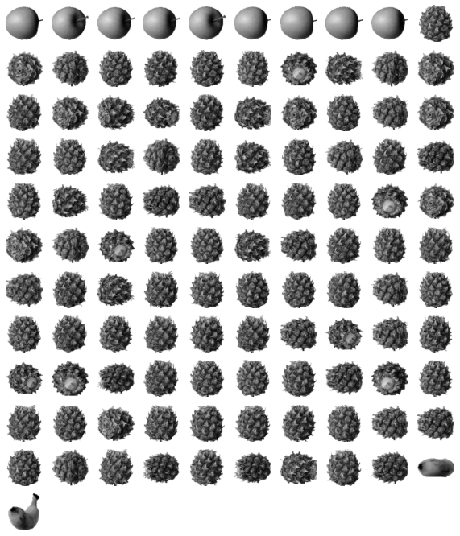
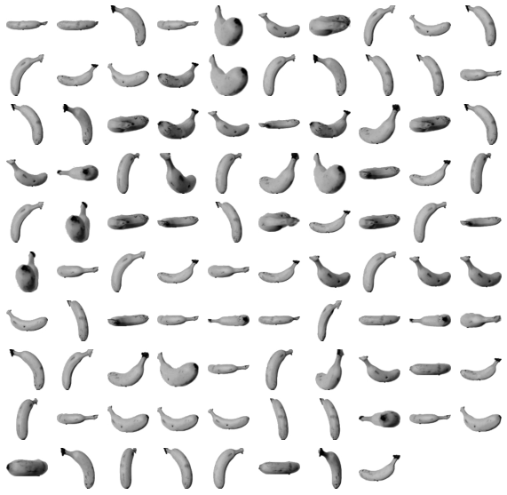
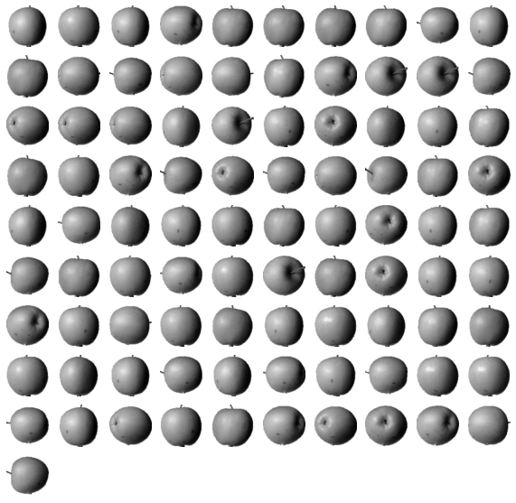
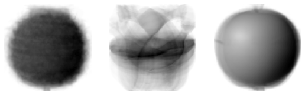
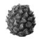
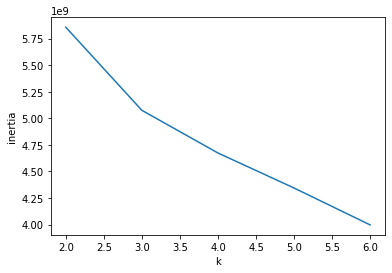

# 06-2 k-평균

## k-평균 알고리즘 소개

* K-means(평균) 알고리즘
    * 군집 알고리즘, 군집의 평균을 자동으로 찾아줌
    * 이 때 군집의 평균은 클러스터의 중심에 위치함
    * 클러스터 중심, 센트로이드라고 부름

* 작동 방식
1. 무작위의 k개의 클러스터 중심을 정함
2. 각 샘플에서 가장 가까운 샘플을 찾아 해당 클러스터 중심의 샘플로 묶음
3. 클러스터에 속한 샘플들의 평균으로 클러스터 중심을 변경
4. 중심에 변화가 없을 때까지 2번 반복

## KMeans 클래스

## 클러스터 중심

## 최적의 k 찾기

## 과일을 자동으로 분류하기

# Assignment #1

 본 챕터에 존재하는 예제 소스를 작성하시오. (또한, 별도로 과제 부여받으신 분들께서도 적절한 Chapter의 본 Assignment Section 이하에 해당 내용을 기재해주세요.)

## 정훈
---
6-3

* 앞서 배운 1절에서는 파인애플, 바나나, 사과의 사진임을 미리 알고 있었음
* 그러므로 평균값을 구할 수 있었지만, 실제 비지도 학습에서는 무슨 데이터인지 알 수 없음

<br/>

wget을 사용한 데이터 불러오기


```python
!wget https://bit.ly/fruits_300_data -O fruits_300.npy
```

    --2022-07-21 08:09:57--  https://bit.ly/fruits_300_data
    Resolving bit.ly (bit.ly)... 67.199.248.11, 67.199.248.10
    Connecting to bit.ly (bit.ly)|67.199.248.11|:443... connected.
    HTTP request sent, awaiting response... 301 Moved Permanently
    Location: https://github.com/rickiepark/hg-mldl/raw/master/fruits_300.npy [following]
    --2022-07-21 08:09:57--  https://github.com/rickiepark/hg-mldl/raw/master/fruits_300.npy
    Resolving github.com (github.com)... 192.30.255.112
    Connecting to github.com (github.com)|192.30.255.112|:443... connected.
    HTTP request sent, awaiting response... 302 Found
    Location: https://raw.githubusercontent.com/rickiepark/hg-mldl/master/fruits_300.npy [following]
    --2022-07-21 08:09:57--  https://raw.githubusercontent.com/rickiepark/hg-mldl/master/fruits_300.npy
    Resolving raw.githubusercontent.com (raw.githubusercontent.com)... 185.199.108.133, 185.199.109.133, 185.199.110.133, ...
    Connecting to raw.githubusercontent.com (raw.githubusercontent.com)|185.199.108.133|:443... connected.
    HTTP request sent, awaiting response... 200 OK
    Length: 3000128 (2.9M) [application/octet-stream]
    Saving to: ‘fruits_300.npy’
    
    fruits_300.npy      100%[===================>]   2.86M  --.-KB/s    in 0.04s   
    
    2022-07-21 08:09:58 (66.6 MB/s) - ‘fruits_300.npy’ saved [3000128/3000128]
    
    
<br/>

np.load( )를 사용한 넘파이 배열 준비


```python
import numpy as np

fruits=np.load('fruits_300.npy')
fruits_2d=fruits.reshape(-1, 100*100)
```

<br/>

KMeans 클래스 임포트


```python
from sklearn.cluster import KMeans

#클러스터 개수가 3인 KMeans 객체(n_clusters로 조절)
km=KMeans(n_clusters=3, random_state=42)
km.fit(fruits_2d)
```


    KMeans(n_clusters=3, random_state=42)


<br/>

KMeans 분류 결과 출력


```python
print(km.labels_)
```

    [2 2 2 2 2 0 2 2 2 2 2 2 2 2 2 2 2 2 0 2 2 2 2 2 2 2 2 2 2 2 2 2 2 2 2 2 2
     2 2 2 2 2 0 2 0 2 2 2 2 2 2 2 0 2 2 2 2 2 2 2 2 2 0 0 2 2 2 2 2 2 2 2 0 2
     2 2 2 2 2 2 2 2 2 2 2 2 2 2 2 2 2 0 2 2 2 2 2 2 2 2 0 0 0 0 0 0 0 0 0 0 0
     0 0 0 0 0 0 0 0 0 0 0 0 0 0 0 0 0 0 0 0 0 0 0 0 0 0 0 0 0 0 0 0 0 0 0 0 0
     0 0 0 0 0 0 0 0 0 0 0 0 0 0 0 0 0 0 0 0 0 0 0 0 0 0 0 0 0 0 0 0 0 0 0 0 0
     0 0 0 0 0 0 0 0 0 0 0 0 0 0 0 1 1 1 1 1 1 1 1 1 1 1 1 1 1 1 1 1 1 1 1 1 1
     1 1 1 1 1 1 1 1 1 0 1 1 1 1 1 1 1 1 1 1 1 1 1 1 1 1 1 1 1 1 1 1 1 1 1 1 1
     1 1 1 1 1 1 1 1 1 1 1 1 1 1 0 1 1 1 1 1 1 1 1 1 1 1 1 1 1 1 1 1 1 1 1 1 1
     1 1 1 1]
    
<br/>

각 레이블 0, 1, 2가 모은 샘플 개수 출력


```python
#0: 111개, 1: 98개, 2: 91개
print(np.unique(km.labels_, return_counts=True))
```

    (array([0, 1, 2], dtype=int32), array([111,  98,  91]))
    
<br/>

받은 array를 출력하기


```python
import matplotlib.pyplot as plt

def draw_fruits(arr, ratio=1):
    #샘플 개수
    n=len(arr)
    #한 줄에 10개씩 이미지 출력을 위해 전체 행 개수 계산
    rows=int(np.ceil(n/10))
    #행이 1개라면 열의 개수는 샘플 개수이므로 len(arr)대입, 그렇지 않으면 10개(위에서 10개로 나눴으므로)
    cols=n if rows<2 else 10
    fig, axs=plt.subplots(rows, cols, figsize=(cols*ratio, rows*ratio), squeeze=False)

    for i in range(rows):
        for j in range(cols):
            #n개까지만 그리기
            if i*10+j<n:
                axs[i, j].imshow(arr[i*10+j], cmap='gray_r')
            axs[i, j].axis('off')
    plt.show()
```

<br/>

불리언 인덱싱(label 0으로 분류된 사진들)


```python
draw_fruits(fruits[km.labels_==0])
```


    

    


<br/>

불리언 인덱싱(label 1으로 분류된 사진들)


```python
draw_fruits(fruits[km.labels_==1])
```


    

    
<br/>

불리언 인덱싱(label 2으로 분류된 사진들)


```python
draw_fruits(fruits[km.labels_==2])
```


    

    

<br/>

클러스터 중심 출력하기


```python
#cluster_centers_: KMeans 클래스가 찾은 클러스터 중심
#앞서 가로*세로로 학습시켰으므로 2차원 배열로 바꿔 출력
draw_fruits(km.cluster_centers_.reshape(-1, 100, 100), ratio=3)
```


    

    

<br/>

100번째 데이터의 클러스터 중심으로부터의 거리


```python
#2차원 배열을 추출하기 위해 슬라이싱 연산자 사용(transform 메소드는 2차원 배열을 기대)
#fruits_2d[100]: (10000, ), fruits_2d[100:101]: (1, 10000)
print(km.transform(fruits_2d[100:101]))
```

    [[3393.8136117  8837.37750892 5267.70439881]]
    

:::info 클러스터의 판단 기준
* 0번째 클러스터 중심과의 거리가 가장 가까우므로 레이블 0에 소속
* 반환형의 크기: (1, 클러스터 개수(3))
:::

<br/>

이미지 예측


```python
#100번째 이미지 예측
print(km.predict(fruits_2d[100:101]))
```

    [0]
    
<br/>

이미지 출력


```python
#파인애플로 예측(label: 0)
draw_fruits(fruits[100:101])
```


    

    

<br/>

클러스터 중심을 옮기는 반복 횟수 출력


```python
print(km.n_iter_)
```

    4
    

:::info 적절한 k값 찾기
* 군집 알고리즘에서 몇 개의 클러스터로 나눌 것인가?
* 엘보우(elbow)방법
* 이너셔(inertia): 클러스터 중심과 클러스터에 속한 샘플들의 거리들의 제곱합(즉 밀집한 정도를 뜻함)
    * 클러스터 개수가 늘어나면 클러스터의 크기가 줄어들기 때문에 이너셔도 줄어드는 것이 일반적
* 엘보우 방법에서 이너셔의 변화를 관찰하여 최적의 클러스터 개수를 찾아냄
:::

<br/>

엘보우 방법 시험


```python
#이너셔 저장 배열(k=2~7)
inertia=[]
#k값을 2~7까지 반복하여 총 5번 학습하고 각각의 이너셔를 저장
for k in range(2, 7):
    km=KMeans(n_clusters=k, random_state=42)
    km.fit(fruits_2d)
    inertia.append(km.inertia_)

plt.plot(range(2, 7), inertia)
plt.xlabel('k')
plt.ylabel('inertia')
plt.show()
```


    

    

:::warning K값
k값이 일정 이상 늘려 꺾이는 지점이 생기면, 그 이후로는 클러스터 개수에 따른 밀집된 정도가 크게 개선되지 않는다.(이니셔의 감소 정도가 줄어든다)
:::