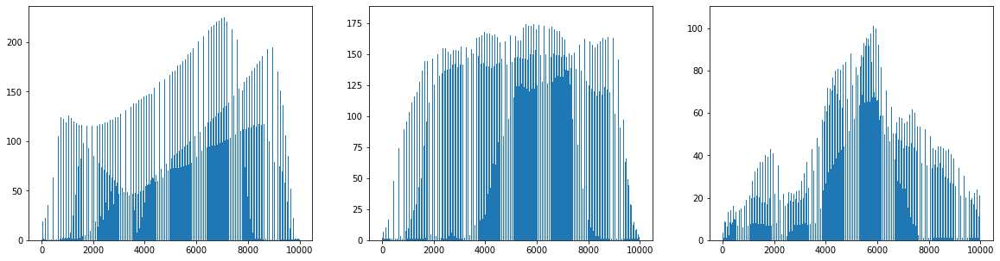
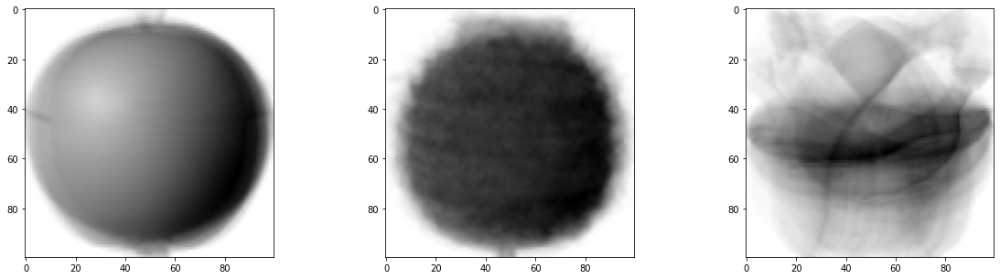
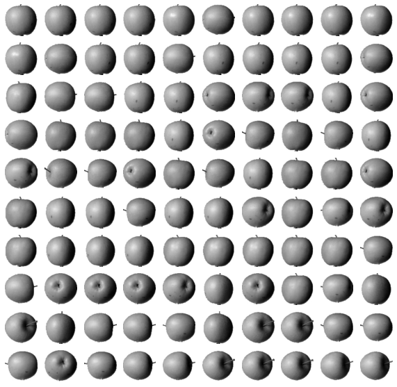
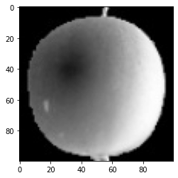
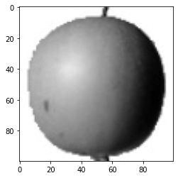
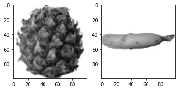
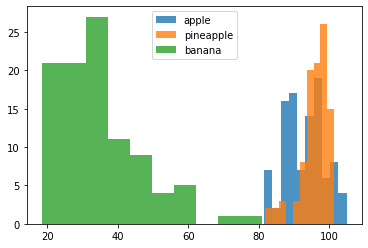

# 06-1 군집 알고리즘

## 타깃을 모르는 비지도 학습

## 과일 사진 데이터 준비하기

## 픽셀값 분석하기

## 평균값과 가까운 사진 고르기

## 비슷한 샘플끼리 모으기

# Assignment #1

 본 챕터에 존재하는 예제 소스를 작성하시오. (또한, 별도로 과제 부여받으신 분들께서도 적절한 Chapter의 본 Assignment Section 이하에 해당 내용을 기재해주세요.)

## 정훈
---

* 비지도 학습: target데이터가 없는 데이터 세트(사람이 가르쳐 주지 않아도, 데이터에 있는 무언가를 학습할 수 있음)


```python
#wget 명령으로 원격 주소에서 데이터를 다운로드하여 저장
!wget https://bit.ly/fruits_300_data -O fruits_300.npy
```

    --2022-07-20 07:25:26--  https://bit.ly/fruits_300_data
    Resolving bit.ly (bit.ly)... 67.199.248.11, 67.199.248.10
    Connecting to bit.ly (bit.ly)|67.199.248.11|:443... connected.
    HTTP request sent, awaiting response... 301 Moved Permanently
    Location: https://github.com/rickiepark/hg-mldl/raw/master/fruits_300.npy [following]
    --2022-07-20 07:25:26--  https://github.com/rickiepark/hg-mldl/raw/master/fruits_300.npy
    Resolving github.com (github.com)... 140.82.113.3
    Connecting to github.com (github.com)|140.82.113.3|:443... connected.
    HTTP request sent, awaiting response... 302 Found
    Location: https://raw.githubusercontent.com/rickiepark/hg-mldl/master/fruits_300.npy [following]
    --2022-07-20 07:25:26--  https://raw.githubusercontent.com/rickiepark/hg-mldl/master/fruits_300.npy
    Resolving raw.githubusercontent.com (raw.githubusercontent.com)... 185.199.111.133, 185.199.110.133, 185.199.108.133, ...
    Connecting to raw.githubusercontent.com (raw.githubusercontent.com)|185.199.111.133|:443... connected.
    HTTP request sent, awaiting response... 200 OK
    Length: 3000128 (2.9M) [application/octet-stream]
    Saving to: ‘fruits_300.npy’
    
    fruits_300.npy      100%[===================>]   2.86M  --.-KB/s    in 0.07s   
    
    2022-07-20 07:25:26 (43.3 MB/s) - ‘fruits_300.npy’ saved [3000128/3000128]
    
    
:::info !로 시작하는 명령어
* 코랩에서 파이썬 명령어가 아닌 리눅스 셸 명령으로 이해
* wget명령어: 실행 후 파일을 보면 파일에 데이터가 다운받아져 있음
* -O(알파벳 o)옵션으로 저장할 파일의 이름을 지정할 수 있음
:::

<br/>

```python
import numpy as np
import matplotlib.pyplot as plt

fruits=np.load('fruits_300.npy')
#샘플 300개, 이미지 높이 x 이미지 너비: 100 x 100
print(fruits.shape)
```

    (300, 100, 100)
    

<br/>


```python
#첫 번째 사진의 첫 번째 행의 픽셀 출력(이미지 너비에 해당하는 100픽셀)
#0에 가까울수록 검은색, 높을수록 밝은색
print(fruits[0, 0, :])
```

    [  1   1   1   1   1   1   1   1   1   1   1   1   1   1   1   1   2   1
       2   2   2   2   2   2   1   1   1   1   1   1   1   1   2   3   2   1
       2   1   1   1   1   2   1   3   2   1   3   1   4   1   2   5   5   5
      19 148 192 117  28   1   1   2   1   4   1   1   3   1   1   1   1   1
       2   2   1   1   1   1   1   1   1   1   1   1   1   1   1   1   1   1
       1   1   1   1   1   1   1   1   1   1]
    
<br/>


```python
#첫 번째 과일 이미지 출력
plt.imshow(fruits[0], cmap='gray')
plt.show()
```


    

    


* 배경이 검은색, 물체가 밝은색으로 넘파이 배열로 변환할 때 반전시킴
* 물체에 집중하여 학습해야 하기 때문에, 물체에 더 높은 값을 주기 위하여 이미지를 반전함(배경을 0에 가까운 낮은 값, 물체에 높은 값)

<br/>

```python
#넘파이 배열로 변환할 때 반전한 이미지를 다시 반전(보기 좋게)
plt.imshow(fruits[0], cmap='gray_r')
plt.show()
```


    

    


<br/>

```python
fig, axs=plt.subplots(1, 2)
#100번째 이미지 출력(subplots의 0번째)
axs[0].imshow(fruits[100], cmap='gray_r')
#200번째 이미지 출력(subplots의 1번째)
axs[1].imshow(fruits[200], cmap='gray_r')
plt.show()
```


    

    


* subplots함수: 여러 개의 그래프를 배열처럼 쌓기
* (1, 2): 하나의 행과 2개의 열

<br/>

```python
#[이미지 개수][가로][세로]의 3차원 배열에서 [이미지 개수][가로*세로]의 2차원 배열로 만들기

#0~99번째 이미지를 각각 10000개의 픽셀로 합친다.
apple=fruits[0:100].reshape(-1, 100*100)
#100~199
pineapple=fruits[100:200].reshape(-1, 100*100)
#200~299
banana=fruits[200: 300].reshape(-1, 100*100)

#apple에 해당하는 이미지(100개의 배열, 원소 배열 안에 10000개의 데이터(100*100))
print(apple.shape)
```

    (100, 10000)
    

<br/>

```python
#axis매개변수: 0이면 행방향(세로), 1이면 열방향(가로)
#사과 이미지(100개)에 대한 전체 픽셀의 평균값 출력
print(apple.mean(axis=1))
```

    [ 88.3346  97.9249  87.3709  98.3703  92.8705  82.6439  94.4244  95.5999
      90.681   81.6226  87.0578  95.0745  93.8416  87.017   97.5078  87.2019
      88.9827 100.9158  92.7823 100.9184 104.9854  88.674   99.5643  97.2495
      94.1179  92.1935  95.1671  93.3322 102.8967  94.6695  90.5285  89.0744
      97.7641  97.2938 100.7564  90.5236 100.2542  85.8452  96.4615  97.1492
      90.711  102.3193  87.1629  89.8751  86.7327  86.3991  95.2865  89.1709
      96.8163  91.6604  96.1065  99.6829  94.9718  87.4812  89.2596  89.5268
      93.799   97.3983  87.151   97.825  103.22    94.4239  83.6657  83.5159
     102.8453  87.0379  91.2742 100.4848  93.8388  90.8568  97.4616  97.5022
      82.446   87.1789  96.9206  90.3135  90.565   97.6538  98.0919  93.6252
      87.3867  84.7073  89.1135  86.7646  88.7301  86.643   96.7323  97.2604
      81.9424  87.1687  97.2066  83.4712  95.9781  91.8096  98.4086 100.7823
     101.556  100.7027  91.6098  88.8976]
    

<br/>

```python
plt.hist(np.mean(apple, axis=1), alpha=0.8)
plt.hist(np.mean(pineapple, axis=1), alpha=0.8)
plt.hist(np.mean(banana, axis=1), alpha=0.8)

plt.legend(['apple', 'pineapple', 'banana'])
plt.show()
```


    

    


* 바나나: 평균값이 40에 집중됨
* 바나나는 픽셀 평균값으로 구분이 용이하나, 사과와 파인애플은 구분이 힘들다. 

<br/>

```python
#axis=0으로 설정해 각 픽셀의 평균을 구하기(10000픽셀 각각의 평균)

fig, axs=plt.subplots(1, 3, figsize=(20, 5))
#10000번씩 반복(10000픽셀에 대한 반복, axis=0: 각 픽셀의 행 방향으로 계산)
axs[0].bar(range(10000), np.mean(apple, axis=0))
axs[1].bar(range(10000), np.mean(pineapple, axis=0))
axs[2].bar(range(10000), np.mean(banana, axis=0))
plt.show()
```


    

    


<br/>

```python
#각 픽셀의 평균을 낸 10000개의 배열에서 다시 100*100의 이미지로 재구성
apple_mean=np.mean(apple, axis=0).reshape(100, 100)
pineapple_mean=np.mean(pineapple, axis=0).reshape(100, 100)
banana_mean=np.mean(banana, axis=0).reshape(100, 100)
fig,axs=plt.subplots(1, 3, figsize=(20, 5))
axs[0].imshow(apple_mean, cmap='gray_r')
axs[1].imshow(pineapple_mean, cmap='gray_r')
axs[2].imshow(banana_mean, cmap='gray_r')
plt.show()
```


    

    


<br/>

```python
#과일 이미지-사과 평균값 이미지의 절대값 배열 구하기(각 이미지-위의 사과 평균 이미지)
abs_diff=np.abs(fruits - apple_mean)
abs_mean=np.mean(abs_diff, axis=(1, 2))

#과일 이미지에서 사과 평균 이미지를 뺀 300개의 이미지 배열
print(abs_mean.shape)
```

    (300,)
    

<br/>

```python
#앞서 구한 배열의 오름차순 배열에서 앞의 100개 이미지 출력(오차가 가장 작은 샘플 100개 출력)
apple_index=np.argsort(abs_mean)[:100]
fig, axs=plt.subplots(10, 10, figsize=(10, 10))
for i in range(10):
    for j in range(10):
        #[i, j]번째 배열에 이미지를 하나씩 출력, i는 10의 가중치를 가진다고 가정하여 배열 인덱스에 i*10 + j를 넣음
        axs[i, j].imshow(fruits[apple_index[i*10+j]], cmap="gray_r")
        axs[i, j].axis('off')
plt.show()
```


    

    


* 군집: 비슷한 샘플을 그룹으로 모으는 작업
* 클러스터: 군집 알고리즘으로 만들어진 그룹의 결과

## 우진

```python
# 데이터 다운로드
!wget https://bit.ly/fruits_300_data -O fruits_300.npy
```

```python
import numpy as np
import matplotlib.pyplot as plt
```


```python
fruits = np.load('fruits_300.npy')
```


```python
# (샘플의 개수, 이미지 높이, 이미지 너비)
print(fruits.shape)
```

    > (300, 100, 100)
    


```python
# 첫번째 이미지의 첫번째 행 모두 선택 [0, 0, :]
print(fruits[0, 0, :])
```

    [  1   1   1   1   1   1   1   1   1   1   1   1   1   1   1   1   2   1
       2   2   2   2   2   2   1   1   1   1   1   1   1   1   2   3   2   1
       2   1   1   1   1   2   1   3   2   1   3   1   4   1   2   5   5   5
      19 148 192 117  28   1   1   2   1   4   1   1   3   1   1   1   1   1
       2   2   1   1   1   1   1   1   1   1   1   1   1   1   1   1   1   1
       1   1   1   1   1   1   1   1   1   1]
    


```python
# 넘파이 배열로 저장된 이미지 출력
# 흑백 이미지기 때문에 cmap='gray'
plt.imshow(fruits[0], cmap='gray')
plt.show()
```


    

    


```python
# 밝은 부분은 0에 가깝고 짙은 부분은 255에 가까움.
# 바탕이 검은색에 가까운 것이 컴퓨터가 처리하기에 좋음.
# 아래의 코드는 단지 눈에 보기 좋게 출력.
plt.imshow(fruits[0], cmap='gray_r')  # cmap='gray_r' 지정을 통해 그림의 배경 반전
plt.show()
```


    

    


```python
fig, axs = plt.subplots(1, 2)   # subplots() : 여러 개의 그래프를 배열처럼 쌓을 수 있도록 도와줌.
axs[0].imshow(fruits[100], cmap='gray_r')
axs[1].imshow(fruits[200], cmap='gray_r')
plt.show()
```


    

    


### 픽셀 값 분석하기


```python
# -1 지정시 자동으로 남은 차원 할당
apple = fruits[0:100].reshape(-1, 100*100)
pineapple = fruits[100:200].reshape(-1, 100*100)
banana = fruits[200:300].reshape(-1, 100*100)
```


```python
print(apple.shape)
```

    > (100, 10000)
    


```python
print(apple.mean(axis=1))   # axis=0 지정 시 행을 따라 계산 / axis=1 지정 시 열을 따라 계산
```

    [ 88.3346  97.9249  87.3709  98.3703  92.8705  82.6439  94.4244  95.5999
      90.681   81.6226  87.0578  95.0745  93.8416  87.017   97.5078  87.2019
      88.9827 100.9158  92.7823 100.9184 104.9854  88.674   99.5643  97.2495
      94.1179  92.1935  95.1671  93.3322 102.8967  94.6695  90.5285  89.0744
      97.7641  97.2938 100.7564  90.5236 100.2542  85.8452  96.4615  97.1492
      90.711  102.3193  87.1629  89.8751  86.7327  86.3991  95.2865  89.1709
      96.8163  91.6604  96.1065  99.6829  94.9718  87.4812  89.2596  89.5268
      93.799   97.3983  87.151   97.825  103.22    94.4239  83.6657  83.5159
     102.8453  87.0379  91.2742 100.4848  93.8388  90.8568  97.4616  97.5022
      82.446   87.1789  96.9206  90.3135  90.565   97.6538  98.0919  93.6252
      87.3867  84.7073  89.1135  86.7646  88.7301  86.643   96.7323  97.2604
      81.9424  87.1687  97.2066  83.4712  95.9781  91.8096  98.4086 100.7823
     101.556  100.7027  91.6098  88.8976]
    

> 히스토그램?
 - 값이 발생한 빈도를 그래프로 표시한 것
 - 보통 x축이 값의 구간(계급)이고, y축은 발생 빈도(도수)


```python
# 샘플의 평균값

# alpha값 : 1보다 작게 지정 시 투명도를 줄 수 있음.
plt.hist(np.mean(apple, axis=1), alpha=0.8)
plt.hist(np.mean(pineapple, axis=1), alpha=0.8)
plt.hist(np.mean(banana, axis=1), alpha=0.8)

# legend() : 범례 생성
plt.legend(['apple', 'pineapple', 'banana'])
plt.show()
```


    

    


> 위 그래프의 문제점
 - 바나나와 사과, 파인애플은 확실히 구분이 되지만, 사과와 파인애플은 겹쳐있는 부분이 많기에 픽셀값만으로 구분하기 어려움.
 - 따라서 샘플의 평균값이 아닌 픽셀별 평균값을 비교(= 전체 샘플에 대해 각 픽셀의 평균을 계산)


```python
# 픽셀의 평균값

fig, axs = plt.subplots(1, 3, figsize=(20, 5))

# axis=0으로 지정 시 픽셀의 평균 구하기 가능
axs[0].bar(range(10000), np.mean(apple, axis=0))
axs[1].bar(range(10000), np.mean(pineapple, axis=0))
axs[2].bar(range(10000), np.mean(banana, axis=0))
plt.show()
```


```python
# 크기를 100x100으로 바꿔서 출력
# 픽셀을 평균 낸 이미지를 모든 사진을 합쳐 놓은 대표 이미지로 생각 가능.
apple_mean = np.mean(apple, axis=0).reshape(100, 100)
pineapple_mean = np.mean(pineapple, axis=0).reshape(100, 100)
banana_mean = np.mean(banana, axis=0).reshape(100, 100)

fig, axs = plt.subplots(1, 3, figsize=(20, 5))
axs[0].imshow(apple_mean, cmap='gray_r')
axs[1].imshow(pineapple_mean, cmap='gray_r')
axs[2].imshow(banana_mean, cmap='gray_r')
plt.show()
```


### 평균값과 가까운 사진 고르기


```python
abs_diff = np.abs(fruits - apple_mean)    # 절댓값 계산
abs_mean = np.mean(abs_diff, axis=(1,2))  # 절댓값 평균
print(abs_mean.shape)
```


```python
# abs_mean이 작은 순서대로 100개 추출
apple_index = np.argsort(abs_mean)[:100]
fig, axs = plt.subplots(10, 10, figsize=(10,10))
for i in range(10):
    for j in range(10):
        axs[i, j].imshow(fruits[apple_index[i*10 + j]], cmap='gray_r')
        axs[i, j].axis('off')
plt.show()
```


> 정리
 - 비지도 학습 : 머신러닝의 한 종류로 훈련 데이터에 타깃(정답값)이 없다. 그렇기에 외부의 도움 없이 스스로 무언가를 학습해야 한다. 대표적으로 군집, 차원 축소 등이 있다.
 - 군집 : 비슷한 샘플끼리 그룹으로 모으는 작업
 - 클러스터 : 군집 알고리즘에서 만든 그룹
 - 히스토그램 : 구간별로 값이 발생한 빈도를 그래프로 표시한 것