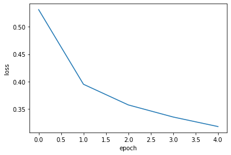
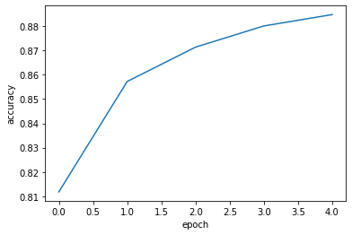
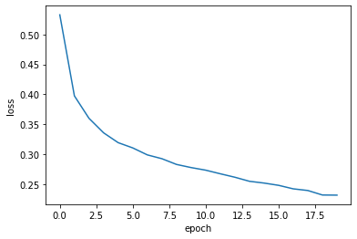
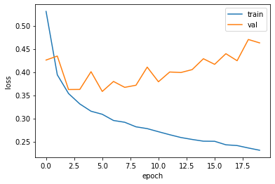
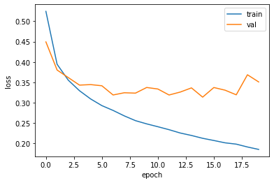
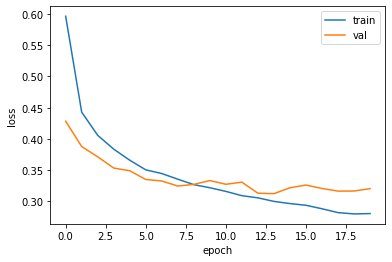
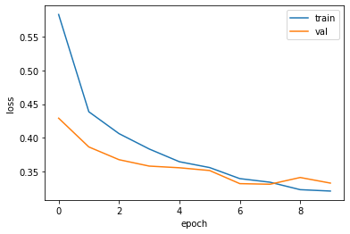

# 07-3 신경망 모델 훈련

## 손실 곡선

## 검증 손실

## 드롭아웃

## 모델 저장과 복원

## 콜백

## 최상의 신경망 모델 얻기


## 우진

### 신경망 모델 훈련


```python
# 실행마다 동일한 결과를 얻기 위해 케라스에 랜덤 시드를 사용하고 텐서플로 연산을 결정적으로 만듭니다. 
import tensorflow as tf

tf.keras.utils.set_random_seed(42)
tf.config.experimental.enable_op_determinism()
```

### 손실 곡선


```python
# 데이터셋 적재 및 세트 분할
from tensorflow import keras
from sklearn.model_selection import train_test_split

(train_input, train_target), (test_input, test_target) = \
    keras.datasets.fashion_mnist.load_data()

train_scaled = train_input / 255.0

train_scaled, val_scaled, train_target, val_target = train_test_split(
    train_scaled, train_target, test_size=0.2, random_state=42)
```


```python
# 모델을 만드는 함수 정의
def model_fn(a_layer=None):
    model = keras.Sequential()
    model.add(keras.layers.Flatten(input_shape=(28, 28)))
    model.add(keras.layers.Dense(100, activation='relu'))
    if a_layer:
        model.add(a_layer)
    model.add(keras.layers.Dense(10, activation='softmax'))
    return model
```


```python
model = model_fn()

model.summary()
```

    Model: "sequential"
    _________________________________________________________________
     Layer (type)                Output Shape              Param #   
    =================================================================
     flatten (Flatten)           (None, 784)               0         
                                                                     
     dense (Dense)               (None, 100)               78500     
                                                                     
     dense_1 (Dense)             (None, 10)                1010      
                                                                     
    =================================================================
    Total params: 79,510
    Trainable params: 79,510
    Non-trainable params: 0
    _________________________________________________________________
    


```python
# 모델 훈련 및 결과를 history 변수에 담기
model.compile(loss='sparse_categorical_crossentropy', metrics='accuracy')

history = model.fit(train_scaled, train_target, epochs=5, verbose=0)
```


```python
# history 딕셔너리에 담긴 데이터 출력
print(history.history.keys())
```

    > dict_keys(['loss', 'accuracy'])
    

- compile() 메서드에서 metrics 매개변수에 'accuracy'를 추가했기 때문에 history 속성에 포함됨.

<br/>

```python
# 에포크마다의 손실 그래프로 출력
import matplotlib.pyplot as plt

plt.plot(history.history['loss'])
plt.xlabel('epoch')
plt.ylabel('loss')
plt.show()
```


    

    


```python
# 에포크마다의 정확도 그래프로 출력
plt.plot(history.history['accuracy'])
plt.xlabel('epoch')
plt.ylabel('accuracy')
plt.show()
```


    

    


```python
# 에포크 횟수 증가 및 모델 훈련
model = model_fn()
model.compile(loss='sparse_categorical_crossentropy', metrics='accuracy')

history = model.fit(train_scaled, train_target, epochs=20, verbose=0)
```


```python
# 손실 그래프 출력
plt.plot(history.history['loss'])
plt.xlabel('epoch')
plt.ylabel('loss')
plt.show()
```


    

    


### 검증 손실


```python
# 케라스 모델의 fit() 메서드에 검증 데이터 전달
# validation_data 매개변수에 검증에 사용할 입력과 타깃값을 튜플로 만들어 전달
model = model_fn()
model.compile(loss='sparse_categorical_crossentropy', metrics='accuracy')

history = model.fit(train_scaled, train_target, epochs=20, verbose=0, 
                    validation_data=(val_scaled, val_target))
```


```python
print(history.history.keys())
```

    > dict_keys(['loss', 'accuracy', 'val_loss', 'val_accuracy'])
    


```python
# 훈련 손실, 검증 손실 그래프 출력
plt.plot(history.history['loss'])
plt.plot(history.history['val_loss'])
plt.xlabel('epoch')
plt.ylabel('loss')
plt.legend(['train', 'val'])
plt.show()
```


    

    


- 훈련 손실이 꾸준히 감소하기에 전형적인 과대적합 모델이 만들어짐.

- 검증 손실이 상승하는 시점을 가능한 뒤로 늦추면 검증 세트에 대한 손실이 줄어들고 검증 세트에 대한 정확도도 증가함.

<br/>

```python
# 옵티마이저를 사용하여 과대적합 완화 시도
model = model_fn()
model.compile(optimizer='adam', loss='sparse_categorical_crossentropy', 
              metrics='accuracy')

history = model.fit(train_scaled, train_target, epochs=20, verbose=0, 
                    validation_data=(val_scaled, val_target))
```


```python
plt.plot(history.history['loss'])
plt.plot(history.history['val_loss'])
plt.xlabel('epoch')
plt.ylabel('loss')
plt.legend(['train', 'val'])
plt.show()
```


    

    


- 검증 손실 그래프에 여전히 요동이 남아 있지만 과대적합이 줄어든 모습을 확인 가능.

### 드롭아웃
 - 은닉층에 있는 뉴런의 출력을 랜덤하게 껴서 과대적합을 막는 기법. 훈련 중에 적용되며 평가나 예측에서는 적용 x


```python
# 30% 드롭아웃
model = model_fn(keras.layers.Dropout(0.3))

model.summary()
```

    Model: "sequential_4"
    _________________________________________________________________
     Layer (type)                Output Shape              Param #   
    =================================================================
     flatten_4 (Flatten)         (None, 784)               0         
                                                                     
     dense_8 (Dense)             (None, 100)               78500     
                                                                     
     dropout (Dropout)           (None, 100)               0         
                                                                     
     dense_9 (Dense)             (None, 10)                1010      
                                                                     
    =================================================================
    Total params: 79,510
    Trainable params: 79,510
    Non-trainable params: 0
    _________________________________________________________________
    

- 훈련이 끝난 뒤에 평가나 예측을 수행할 때는 드롭아웃을 적용하지 말아야 한다. 훈련된 모든 뉴런을 사용해야 올바른 예측 수행이 가능하기 때문.

- TF와 케라스는 모델을 평가와 예측에 사용할 때는 자동으로 드롭아웃을 적용하지 않음.

<br/>


```python
# 훈련 및 검증 손실 그래프 출력
model.compile(optimizer='adam', loss='sparse_categorical_crossentropy', 
              metrics='accuracy')

history = model.fit(train_scaled, train_target, epochs=20, verbose=0, 
                    validation_data=(val_scaled, val_target))
```


```python
plt.plot(history.history['loss'])
plt.plot(history.history['val_loss'])
plt.xlabel('epoch')
plt.ylabel('loss')
plt.legend(['train', 'val'])
plt.show()
```


    

    


- 20번의 에포크동안 훈련되었기에 과대적합된 모델.

### 모델 저장과 복원


```python
model = model_fn(keras.layers.Dropout(0.3))
model.compile(optimizer='adam', loss='sparse_categorical_crossentropy', 
              metrics='accuracy')

history = model.fit(train_scaled, train_target, epochs=10, verbose=0, 
                    validation_data=(val_scaled, val_target))
```


```python
# 훈련된 모델의 파라미터 저장하는 메서드 save_weights()
model.save_weights('model-weights.h5')
```


```python
# 모델 구조와 모델 파라미터를 함께 저장하는 메서드 save()
model.save('model-whole.h5')
```


```python
!ls -al *.h5
```

    -rw-r--r-- 1 studio-lab-user users  333448 May 19 01:08 model-weights.h5
    -rw-r--r-- 1 studio-lab-user users  982664 May 19 01:08 model-whole.h5
    


```python
# 훈련을 하지 않은 새로운 모델에 저장된 훈련된 모델 파라미터를 읽어서 사용
model = model_fn(keras.layers.Dropout(0.3))

model.load_weights('model-weights.h5')  # 저장된 훈련된 모델 파라미터 불러오기
```

- 케라스의 predict()는 사이킷런과 달리 샘플마다 10개의 클래스에 대한 확률을 반환.

<br/>


```python
# predict() 메서드 결과에서 가장 큰 값을 고르기 위해 argmax() 메서드 사용
import numpy as np

val_labels = np.argmax(model.predict(val_scaled), axis=-1)  # axis=-1 : 배열의 마지막 차원을 따라 최댓값 선택
print(np.mean(val_labels == val_target))
```

    375/375 [==============================] - 1s 1ms/step
    
    > 0.8825
    


```python
model = keras.models.load_model('model-whole.h5') # 모델이 저장된 파일 읽기

model.evaluate(val_scaled, val_target)  # 검증 세트의 정확도 출력
```

    375/375 [==============================] - 1s 1ms/step - loss: 0.3332 - accuracy: 0.8825
    
    > [0.3332017660140991, 0.8824999928474426]


### 콜백
 - 케라스 모델을 훈련하는 도중에 어떤 작업을 수행할 수 있도록 도와주는 도구
 - 대표적으로 최상의 모델을 자동으로 저장(checkpoint)해 주거나 검증 점수가 더 이상 향상되지 않으면 일찍 종료(Early Stopping)할 수 있음.

<br/>

```python
model = model_fn(keras.layers.Dropout(0.3))
model.compile(optimizer='adam', loss='sparse_categorical_crossentropy', 
              metrics='accuracy')

# callbacks 매개변수에 리스트로 감싸서 전달. 모델이 훈련한 후 best-model.h5에 최상의 검증 점수를 낸 모델이 저장됨.
checkpoint_cb = keras.callbacks.ModelCheckpoint('best-model.h5', 
                                                save_best_only=True)

model.fit(train_scaled, train_target, epochs=20, verbose=0, 
          validation_data=(val_scaled, val_target),
          callbacks=[checkpoint_cb])
```

    <keras.callbacks.History at 0x1bc03fb6d00>


```python
# 저장된 위의 모델을 불러와 예측 수행
model = keras.models.load_model('best-model.h5')

model.evaluate(val_scaled, val_target)
```

    375/375 [==============================] - 1s 2ms/step - loss: 0.3141 - accuracy: 0.8875
    
    > [0.31406131386756897, 0.887499988079071]


```python
# ModelCheckpoint와 EarlyStopping 콜백 함께 사용
model = model_fn(keras.layers.Dropout(0.3))
model.compile(optimizer='adam', loss='sparse_categorical_crossentropy', 
              metrics='accuracy')

checkpoint_cb = keras.callbacks.ModelCheckpoint('best-model.h5', 
                                                save_best_only=True)    # True시 가장 낮은 검증 점수를 만드는 모델을 저장

early_stopping_cb = keras.callbacks.EarlyStopping(patience=2,
                                                  restore_best_weights=True)    # 최상의 모델 가중치를 복원할지 지정

history = model.fit(train_scaled, train_target, epochs=20, verbose=0, 
                    validation_data=(val_scaled, val_target),
                    callbacks=[checkpoint_cb, early_stopping_cb])
```


```python
# 10번째 에포크에서 훈련이 중지되었음을 의미.
print(early_stopping_cb.stopped_epoch)
```

    > 9
    


```python
# 훈련, 검증 손실 그래프 출력
plt.plot(history.history['loss'])
plt.plot(history.history['val_loss'])
plt.xlabel('epoch')
plt.ylabel('loss')
plt.legend(['train', 'val'])
plt.show()
```


    

    


```python
# 조기 종료로 얻은 모델을 사용해 검증 세트에 대한 성능 확인
model.evaluate(val_scaled, val_target)
```

    375/375 [==============================] - 0s 911us/step - loss: 0.3310 - accuracy: 0.8802
    
    > [0.3309730887413025, 0.8802499771118164]

### 🌱 정리

> - 드롭아웃 : 은닉층에 있는 뉴런의 출력을 랜덤하게 꺼서 과대적합을 막는 기법. 드롭아웃은 훈련 중에 적용되며 평가나 예측에서는 적용하지 않음.
> - 콜백 : 케라스 모델을 훈련하는 도중에 어떤 작업을 수행할 수 있도록 도와주는 도구. 대표적으로 최상의 모델을 자동으로 저장해주거나(checkout) 검증 점수가 더 이상 향상되지 않으면 일찍 종료할 수 있다.(Early Stopping)
> - 조기 종료(Early Stopping) : 검증 점수가 더 이상 감소하지 않고 상승하여 과대적합이 일어나면 훈련을 계속 진행하지 않고 멈추는 기법. 계산 비용과 시간을 절약할 수 있음.