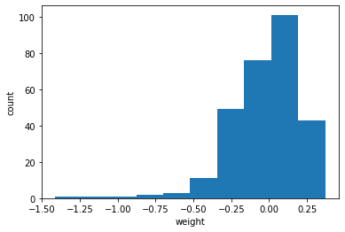
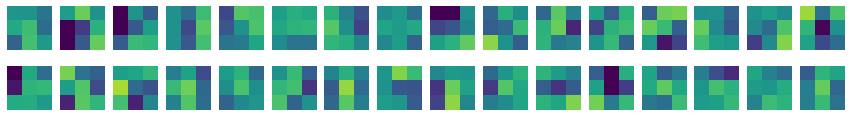
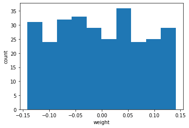
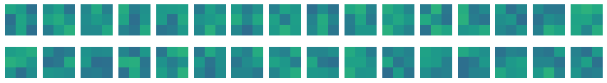
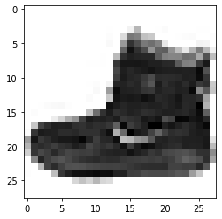
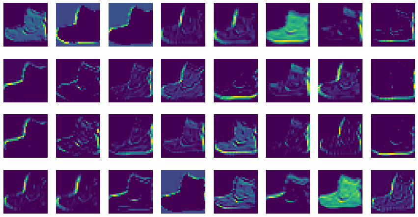
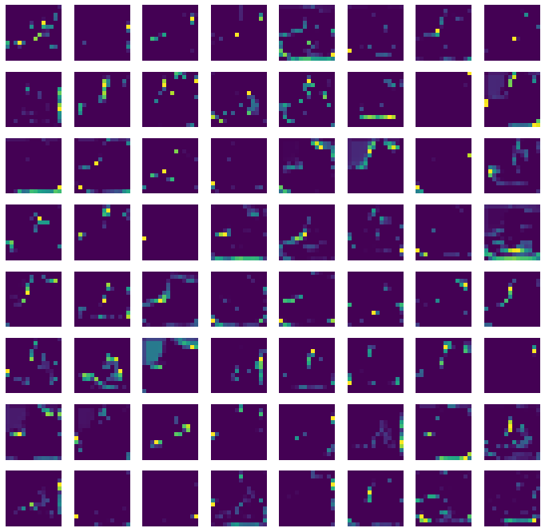

# 08-3 합성곱 신경망의 시각화

## 가중치 시각화

## 함수형 API

## 특성 맵 시각화

## 시각화로 이해하는 합성곱 신경망

## 정훈
---

### 합성곱 신경망의 시각화


```python

import tensorflow as tf

tf.keras.utils.set_random_seed(42)
tf.config.experimental.enable_op_determinism()
```

### 가중치 시각화


```python
from tensorflow import keras
```


```python
!wget https://github.com/rickiepark/hg-mldl/raw/master/best-cnn-model.h5
```

    --2022-07-29 14:16:50--  https://github.com/rickiepark/hg-mldl/raw/master/best-cnn-model.h5
    Resolving github.com (github.com)... 140.82.121.4
    Connecting to github.com (github.com)|140.82.121.4|:443... connected.
    HTTP request sent, awaiting response... 302 Found
    Location: https://raw.githubusercontent.com/rickiepark/hg-mldl/master/best-cnn-model.h5 [following]
    --2022-07-29 14:16:50--  https://raw.githubusercontent.com/rickiepark/hg-mldl/master/best-cnn-model.h5
    Resolving raw.githubusercontent.com (raw.githubusercontent.com)... 185.199.108.133, 185.199.109.133, 185.199.110.133, ...
    Connecting to raw.githubusercontent.com (raw.githubusercontent.com)|185.199.108.133|:443... connected.
    HTTP request sent, awaiting response... 200 OK
    Length: 4049416 (3.9M) [application/octet-stream]
    Saving to: ‘best-cnn-model.h5.1’
    
    best-cnn-model.h5.1 100%[===================>]   3.86M  --.-KB/s    in 0.03s   
    
    2022-07-29 14:16:50 (154 MB/s) - ‘best-cnn-model.h5.1’ saved [4049416/4049416]
    
    


```python
model = keras.models.load_model('best-cnn-model.h5')
```


```python
#층 출력
model.layers
```


    [<keras.layers.convolutional.Conv2D at 0x7fa28a4bec90>,
     <keras.layers.pooling.MaxPooling2D at 0x7fa28a4e0fd0>,
     <keras.layers.convolutional.Conv2D at 0x7fa310354b90>,
     <keras.layers.pooling.MaxPooling2D at 0x7fa28a4ddd50>,
     <keras.layers.core.flatten.Flatten at 0x7fa28a4ddd90>,
     <keras.layers.core.dense.Dense at 0x7fa28a4ddc10>,
     <keras.layers.core.dropout.Dropout at 0x7fa28a4e0410>,
     <keras.layers.core.dense.Dense at 0x7fa28a4ee8d0>]


```python
#커널 크기(3, 3), 깊이 1
conv = model.layers[0]
print(conv.weights[0].shape, conv.weights[1].shape)
```

    (3, 3, 1, 32) (32,)
    


```python
conv_weights = conv.weights[0].numpy()
print(conv_weights.mean(), conv_weights.std())
```

    -0.021033935 0.23466988
    


```python
import matplotlib.pyplot as plt
```


```python
plt.hist(conv_weights.reshape(-1, 1))
plt.xlabel('weight')
plt.ylabel('count')
plt.show()
```


    

    


```python
fig, axs = plt.subplots(2, 16, figsize=(15,2))

for i in range(2):
    for j in range(16):
        axs[i, j].imshow(conv_weights[:,:,0,i*16 + j], vmin=-0.5, vmax=0.5)
        axs[i, j].axis('off')

plt.show()
```


    

    


```python
no_training_model = keras.Sequential()

no_training_model.add(keras.layers.Conv2D(32, kernel_size=3, activation='relu', 
                                          padding='same', input_shape=(28,28,1)))
```


```python
no_training_conv = no_training_model.layers[0]

print(no_training_conv.weights[0].shape)
```

    (3, 3, 1, 32)
    


```python
no_training_weights = no_training_conv.weights[0].numpy()

print(no_training_weights.mean(), no_training_weights.std())
```

    -0.0029798597 0.08092386
    


```python
plt.hist(no_training_weights.reshape(-1, 1))
plt.xlabel('weight')
plt.ylabel('count')
plt.show()
```


    

    


```python
fig, axs = plt.subplots(2, 16, figsize=(15,2))

for i in range(2):
    for j in range(16):
        axs[i, j].imshow(no_training_weights[:,:,0,i*16 + j], vmin=-0.5, vmax=0.5)
        axs[i, j].axis('off')

plt.show()
```


    

    


### 함수형 API


```python
print(model.input)
```

    KerasTensor(type_spec=TensorSpec(shape=(None, 28, 28, 1), dtype=tf.float32, name='conv2d_input'), name='conv2d_input', description="created by layer 'conv2d_input'")
    


```python
conv_acti = keras.Model(model.input, model.layers[0].output)
```

### 특성 맵 시각화


```python
(train_input, train_target), (test_input, test_target) = keras.datasets.fashion_mnist.load_data()
```

    Downloading data from https://storage.googleapis.com/tensorflow/tf-keras-datasets/train-labels-idx1-ubyte.gz
    32768/29515 [=================================] - 0s 0us/step
    40960/29515 [=========================================] - 0s 0us/step
    Downloading data from https://storage.googleapis.com/tensorflow/tf-keras-datasets/train-images-idx3-ubyte.gz
    26427392/26421880 [==============================] - 0s 0us/step
    26435584/26421880 [==============================] - 0s 0us/step
    Downloading data from https://storage.googleapis.com/tensorflow/tf-keras-datasets/t10k-labels-idx1-ubyte.gz
    16384/5148 [===============================================================================================] - 0s 0us/step
    Downloading data from https://storage.googleapis.com/tensorflow/tf-keras-datasets/t10k-images-idx3-ubyte.gz
    4423680/4422102 [==============================] - 0s 0us/step
    4431872/4422102 [==============================] - 0s 0us/step
    


```python
plt.imshow(train_input[0], cmap='gray_r')
plt.show()
```


    

    


```python
inputs = train_input[0:1].reshape(-1, 28, 28, 1)/255.0

feature_maps = conv_acti.predict(inputs)
```


```python
print(feature_maps.shape)
```

    (1, 28, 28, 32)
    


```python
fig, axs = plt.subplots(4, 8, figsize=(15,8))

for i in range(4):
    for j in range(8):
        axs[i, j].imshow(feature_maps[0,:,:,i*8 + j])
        axs[i, j].axis('off')

plt.show()
```


    

    


```python
conv2_acti = keras.Model(model.input, model.layers[2].output)
```


```python
feature_maps = conv2_acti.predict(train_input[0:1].reshape(-1, 28, 28, 1)/255.0)
```


```python
print(feature_maps.shape)
```

    (1, 14, 14, 64)
    


```python
fig, axs = plt.subplots(8, 8, figsize=(12,12))

for i in range(8):
    for j in range(8):
        axs[i, j].imshow(feature_maps[0,:,:,i*8 + j])
        axs[i, j].axis('off')

plt.show()
```


    

    

